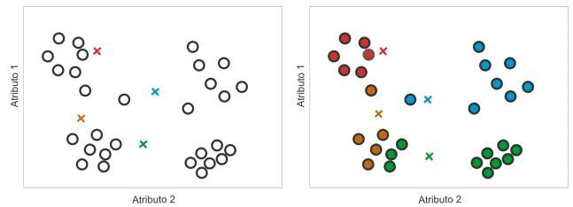
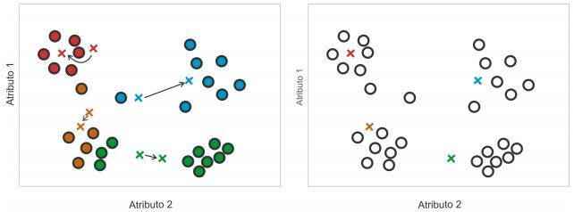
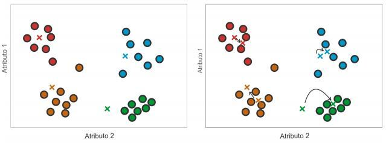

Neste capítulo são descritos aspectos metodológicos para a realização do trabalho. É apresentado o modelo de Regressão Linear Múltipla e o algoritmo Random Forest, que é um algoritmo de aprendizado de máquina baseado em *ensemble*, além de técnicas estatísticas para a obtenção de novas variáveis e melhorias do modelo.

## Aprendizado Supervisionado

O método de aprendizado supervisionado necessita de um conjunto de variáveis independentes $(X_1, X_2, X_3, ...)$, que devem possuir alguma influência em uma ou mais variáveis que podem ser chamadas de variáveis dependentes ou variáveis respostas $(Y_1,Y_2,Y_3,...)$ [@friedman2001elements]. Este trabalho, por exemplo, tem como interesse utilizar como variáveis independentes algumas medidas de locações disponíveis no site Airbnb para predizer o preço da diária, sendo assim, tem-se como objetivo:

$$
Y = f(\boldsymbol{X}) + \epsilon,
$$

\noindent onde $f(.)$ é uma função desconhecida, $\epsilon$ é um erro aleatório com média zero e variância $\sigma^2$ e $\boldsymbol{X}$ o conjunto das variáveis independentes $(X_1, X_2, X_3, ...)$.

Os modelos supervisionados têm como objetivo utilizar uma amostra de $\boldsymbol{X}$ e $Y$ conhecidos para encontrar $\hat{f}$, uma estimativa da função desconhecida $f$.

### Avaliação de Modelos

Para a definição da métrica de erro que será utilizada para a avaliação do modelo, primeiro é necessário definir o tipo de problema a ser resolvido, sendo um problema de regressão ou de classificação, essa definição é feita por meio da observação da variável resposta. Tendo a métrica de erro definida, é possível realizar a estimativa da função $f$ e encontrar uma estimativa da variável resposta $\hat{Y} = \hat{f}(\boldsymbol{X})$ e com isso mensurar o erro do modelo.

Este trabalho será baseado em um problema do tipo regressão, onde $Y$ é uma variável contínua.

Uma forma de testar a estimativa da função $f$ é realizar uma amostra das observações (linhas) da base de dados, e com isso separar em dois conjuntos $(Y_o, \boldsymbol{X_0})$ e $(Y_1, \boldsymbol{X_1})$, onde uma parte será utilizada para estimar a função e outra para testar essa estimativa. Além disto, pode ser útil para identificar o sobreajuste do modelo/algoritmo, um problema que ocorre onde o modelo/algoritmo fica superajustado a base de treino e perde o poder de generalização.

Serão utilizados quatro critérios para avaliar a qualidade preditiva de um modelo/algoritmo de previsão, que são: Erro Quadrático Médio (EQM), Raiz do Erro Quadrático Médio (REQM), Erro Absoluto Médio (EAM) e Erro Percentual Absoluto Médio (EPAM). Essas métricas são úteis para comparar diferentes métodos aplicados ao mesmo conjunto de dados.

- Erro quadrático médio

O erro quadrático médio (EQM), traduz o valor médio dos desvios ao quadrado entre os valores observados e as previsões para as observações $1, 2,\dots,n$, ou seja,

$$EQM = \frac{1}{n}\sum_{i=1}^n(Y_i - \hat{Y}_i)^2.$$

- Raiz do Erro Quadrático Médio

Muitas vezes, a raiz do erro quadrático médio é preferida ao EQM porque permite reduzir a grandeza dos valores para a mesma escala dos dados, definida como:

$$REQM = \sqrt{EQM}.$$

- Erro Absoluto Médio

Historicamente, a REQM e o EQM são medidas bastante utilizadas. No entanto, estas medidas são mais sensíveis a outliers do que outras do mesmo tipo, como, por exemplo, o erro absoluto médio, que se define como:

$$EAM = \frac{1}{n} \sum_{i=1}^n |Y_i - \hat{Y}_i|.$$

- Erro Percentual Absoluto Médio

O erro percentual absoluto médio, EPAM, representa a percentagem média do erro de previsão em relação à grandeza das observações, sendo, portanto, uma medida de erros percentuais, que se define como:

$$EPAM =  \frac{1}{n} \sum_{i=1}^n \left| \frac{Y_i - \hat{Y}_i}{Y_i} \right|.$$


### Validação cruzada

Como citado anteriormente, será utilizada a separação da base de dados para o treinamento e teste do modelo. Na maioria de modelos/algoritmos de aprendizagem de máquina, há parâmetros que precisam ser informados antes do treinamento. Essas informações são chamadas de hiperparâmetros. Com isso, a otimização de hiperparâmetros é o problema de escolher um conjunto de hiperparâmetros (detalhados posteriormente) ideais para um algoritmo de aprendizagem. Por isso é necessário uma otimização manual.

Para isso, será utilizada a técnica de validação cruzada, que consiste em separar a base de treino em $K$ partes, onde serão realizadas $K$ rodadas, onde na rodada $T$ a parte $T$ será utilizada para testar o modelo e as demais partes serão utilizadas para o treinamento de um modelo, esse algoritmo é representado na Figura \ref{img:kfold}.

](../fig/kfold.png){height=40%}


Resumidamente, para cada teste de hiperparâmetro teremos $K$ avaliações e com isso é possível ter uma ideia do poder preditivo da função estimada ($\hat{f}$) e também de sua variabilidade. Com a validação cruzada podemos testar vários cenários antes de colocarmos o nosso modelo em produção e avaliar a capacidade de generalização de um modelo.

```{r child='04.2-linear.rmd'}
```

```{r child='04.3-ensemble.rmd'}
```


## Aprendizado Não Supervisionado

Diferente do aprendizado supervisionado, como os três algoritmos/modelos apresentados anteriormente, o aprendizado não supervisionado não possui variável resposta. Neste trabalho será abordado o método K-means, que é utilizado em tarefas de clusterização, onde o objetivo é criar uma quantidade $K$ de clusters utilizando os dados provenientes do site @datario, para verificar se há alguma relação da distribuição de propriedades e preço com variáveis relacionadas a economia, educação e saúde do bairro.

### K-means

O algoritmo de clusterização K-means (também chamado de K-médias) é comumente usado devido a sua facilidade de implementação [@jain1999data]. Utiliza o conceito de centróides como padrões representativos dos grupos, onde o centróide representa o centro de um grupo, sendo calculado pela média de todos os objetos do grupo [@fontanaestudo].

De acordo com @fontanaestudo, o algoritmo pode ser descrito a partir dos seguintes passos:

1. Atribuem-se valores iniciais para os centróides seguindo algum critério, por exemplo, sorteio aleatório desses valores dentro dos limites de domínio de cada atributo;

2. Aloca-se para cada objeto ao grupo cujo centróides possua maior similaridade com o objeto;

3. Recalcula-se o valor do centróide de cada grupo, como sendo a média dos objetos atuais do grupo;

4. Repete-se os passos 2 e 3 até que os grupos se estabilizem.

Na Figura \ref{fig:passo1} tem-se a execução do passo 1 e 2 do algoritmo, a inicialização dos protótipos para atribuir cada objeto ao grupo cujo centróides possui maior similaridade ao objeto.



Na Figura \ref{fig:passo2} tem-se a execução do passo 3, o recálculo dos valores dos protótipos, como sendo a média dos atributos dos objetos atualmente presentes em cada grupo para posteriormente repetir os passos 2 e 3, com a independência dos objetos dos grupos a que pertenciam.



Por fim, na Figura \ref{fig:passo3}, a repetição dos passos 2 e 3, respectivamente. O algoritmo continuaria a repetir os passos 2 e 3 enquanto ocorrer alterações nos grupos.



Para que seja feito o processo descrito acima é necessário uma noção de distância ou de similaridade, onde a medida mais simples, e que será considerada neste trabalho, é a distância euclidiana entre dois pontos, definida abaixo:

$$
d(p_1,p_2) = \sqrt{(p_1 - p_2)^2},
$$

\noindent onde $p_1$ e $p_1$ são dois pontos unidimensionais.

O objetivo deste algoritmo é minimizar a variabilidade dentro de cada cluster, que pode ser definido como a soma quadrática das distâncias euclidianas entre os itens e o centróide, como na fórmula abaixo, onde $x_i$ é uma observação e $\mu_k$ é a média do cluster:

$$
W(C_k) = \sum_{x_i \in C_k}(x_i-\mu_k)^2 
$$

Para a definição da quantidade $K$ de clusters, utiliza-se um dos métodos mais simples conhecido como *Elbow Method* (método cotovelo), que consiste em testar quantidades de clusters até encontrar a quantidade $K$ onde o acréscimo de clusters não apresente uma queda significativa na variação total dentro do cluster (WSS). Este método inicia com apenas um cluster, armazena a variação total dentro do cluster e incrementa a quantidade de cluster até chegar ao valor máxima definido inicialmente. Sendo assim, quando não houver um salto relevante  entre uma quantidade de cluster e a próxima quantidade, entende-se que o algoritmo é relevante com aquela quantidade $K$ e então ele deve ser usado pra segmentar os dados. A variação é representada matematicamente abaixo:

$$
WSS = \sum_{k=1}^K W(C_k)
$$

