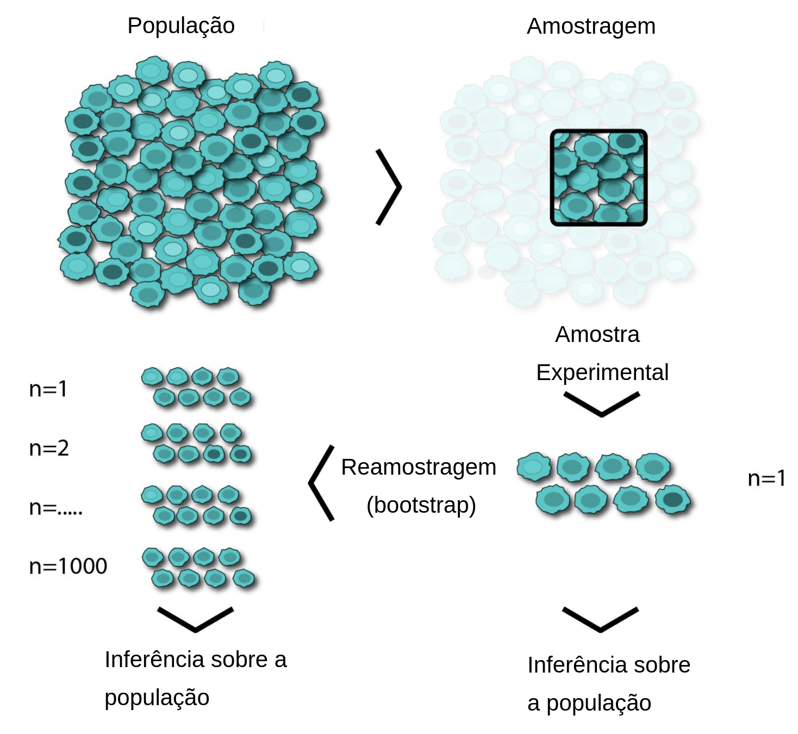
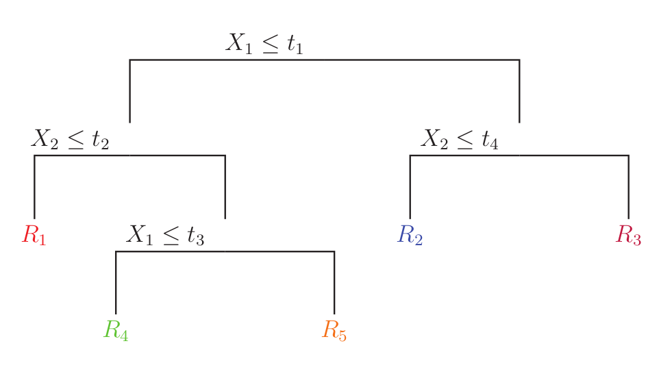

### Métodos Ensemble

Muitos pesquisadores buscam maneiras de combinar a previsão de diversos modelos para criar um único modelo que possua uma taxa de acertos maior [@opitz1999popular]. Os dois principais algoritmos que atendem esse objetivo são: *bootstrap aggregating* [@breiman1996bagging] e *boosting* [@schapire1999brief]. Ambos os algoritmos utilizam um modelo base como regressão logistica [@friedman2000additive], árvores de decisão, redes neurais [@martinez2019sequential], e qualquer outro modelo de aprendizagem supervisionada.

#### Bootstrap

O procedimento Bootstrap é uma técnica de reamostragem, bastante utilizada em diferentes situações estatísticas. A base da técnica é a obtenção de um “novo” conjunto de
dados, por reamostragem do conjunto de dados original. O aumento de poder computacional estimulou o desenvolvimento de novos métodos estatísticos que são computacionalmente intensivos, como o próprio bootstrap introduzido por @efron1994introduction. O objetivo é a estimativa de um parâmetro da população como pode ser visto na Figura \ref{fig:bootstrap}. O procedimento é útil nos casos em que o estimador é uma função complexa dos parâmetros verdadeiros [@murphy2012probabilistic].

Numa análise, normalmente, temos uma amostra de uma população do interesse no 
estudo. A análise é realizada nesta amostra. Utilizando o bootstrap, é feito 
uma amostragem aleatória com reposição dessa amostra e simulando diversas 
outras possíveis amostras que poderiam ser retiradas da população.

{height=40%}

#### Árvore de decisão

O sucesso dos algoritmos de árvores de decisão é explicado por vários fatores que os tornam bastante atraentes na prática:

- As árvores de decisão são não-paramétricas. Eles podem modelar arbitrariamente relações complexas entre variáveis explicativas e variável resposta, sem qualquer suposição a priori;
- Facilidade em lidar com dados heterogêneos (variáveis ordenadas ou categóricas ou uma mistura de ambas);
- Implementação intrínseca na seleção de variáveis;
- As árvores de decisão são robustas para discrepâncias ou erros nos rótulos;
- As árvores de decisão são facilmente interpretáveis.

Existem diversos algoritmos relacionados a árvores de decisão, variando a forma que é feita a seleção das variáveis, dos pontos de divisão, entre outros. Um dos algoritmos mais utilizados é o algoritmo *classification and regression trees (CART)*, cujo ponto principal que o diferencia dos demais é que este aceita variáveis repostas não categóricas.

O algoritmo utilizado neste trabalho utiliza árvores binárias, que, para dados categóricos, significa estar ou não em uma determinada categoria e, para dados numéricos, significa ser menor ou igual a um ponto de divisão ($t$) ou ser maior que este ponto. Segundo @robert2014machine, árvores não binárias apresentam alta fragmentação dos dados, o que pode resultar em um modelo estatístico muito bem ajustado ao conjunto de dados, mas se mostrar ineficaz para prever novos resultados (*overfitting*). 

Como citado no começo desta seção, o ponto forte deste algoritmo é que a interpretação é muito simples, como pode ser visto na Figura \ref{fig:tree}. Caso a primeira variável ($X_1$) fosse menor ou igual ao ponto $t_1$, teríamos uma nova verificação da segunda variável ($X_2$). Sendo ainda menor ou igual ao ponto $t_2$, neste caso, cairíamos na região $R_1$. Caso contrário, é feita a verificação se a primeira variável $X_1$ é menor ou igual $t_3$ e, caso positivo, temos o resultado da região $R4$, e assim por diante. Pela facilidade de interpretação esse algoritmo é muito utilizado, porém como são modelos mais simples é esperado baixo poder preditivo.

{height=30%}

É de suma importância identificar como as árvores de regressão são particionadas e como ocorre o seu crescimento. Os dados consistem em p entradas e uma resposta, para cada uma das N observações: ou seja, ($x_i,y_i$) para i = 1, 2, $\dots$, N, com $x_i$ = ($x_{i,1}, x_{i,2}, \dots, x_{i,p}$). De forma automática, o algoritmo determina as variáveis a serem utilizadas e seus pontos de divisão, além da forma que  a árvore tomará. Suponha primeiro que temos M regiões, sendo elas $R_1$, $R_2$, $\dots$, $R_M$ e modelamos a resposta como um $w_m$ constante em cada região, sendo sua função estimada escrita da seguinte maneira:

$$
\hat{f}(x) = \sum^M_{m=1}w_m I(x \in R_m),
$$

\noindent onde $I(x \in R_m)$ denota a função indicadora para o evento ${x \in R_m}$

Ao adotarmos como critério a minimização da soma dos quadrados $\sum (y_i - f(x_i))^2$, o melhor $w_m$ será apenas a média de $y_i$ na região $R_m$:

$$\hat{w}_m= \hbox{média} (y_i|x_i \in R_m).$$

Não existe uma forma fechada (determinística) para encontrar a melhor partição binária que minimize a soma dos quadrados dos resíduos. Por isso, é necessário um algoritmo computacionalmente intenso, onde são testadas diversas partições. Começando com todos os dados, considere uma variável de divisão $X_j$ e pontos de divisão t e a definição do par em semiplanos.

Para variáveis numéricas, o ponto de divisão t é um valor numérico, então tem-se:

$$R_1(j,t) = \left\{ X|X_j \leq t \right\} \hbox{ e }  R_2(j,t) = \left\{X|X_j > t \right\}$$

Para variáveis categóricas, t é um conjunto de categorias e por isso tem-se:

$$R_1(j,t) = \left\{ X|X_j \in t \right\} \hbox{ e }  R_2(j,t) = \left\{X|X_j \notin t \right\}$$

Em seguida, busca-se a variável de divisão $X_j$ e os pontos de divisão t que resolvem:

$$\hat{i}(j,t) = \underset{j,t}{\min} \left[ \underset{w_1}{\min} \sum_{x_i \in R_1 (j,t)} (y_i - w_1)^2 + \underset{w_2}{\min}  \sum_{x_i \in R_2 (j,t)} (y_i - w_2)^2   \right]$$

Para qualquer opção j e t, a minimização é resolvida por:

$$\hat{w}_1 = \hbox{média}(y_i|x_i \in R_1(j,t)) \hbox{ e } \hat{w}_2 = \hbox{média} (y_i|x_i \in R_2(j,t)).$$

Tendo encontrado a melhor divisão, os dados são particionados nas duas regiões resultantes e o processo de divisão é refeito. Então esse processo é repetido em todas as regiões resultantes.

Para evitar o ajuste excessivo, podemos parar de cultivar a árvore se a redução no erro não for suficiente para justificar a complexidade extra de adicionar uma subárvore a mais. No entanto, isso pode não ser claro. A abordagem padrão é, portanto, cultivar uma árvore "cheia" e depois realizar a poda. Isso pode ser feito usando um esquema que remove as ramificações, dando o mínimo de aumento no erro. Mais detalhes podem ser encontrados em @breiman1984j.

Os principais hiperparâmetros do método são:

- Profundidade máxima e quantidade máxima de nós (altos valores podem apresentar problemas de *overfitting*);

- Número mínimo de observações no nó.

As variáveis explicativas raramente são igualmente relevantes para a previsão e criação da árvore. Frequentemente, apenas algumas delas têm influência substancial na resposta. A grande maioria é irrelevante e poderia muito bem não ter sido incluída. Para uma decisão simples de uma árvore, @breiman1984j propôs o seguinte cálculo para a importância das variáveis:

$$
\Upsilon(X_j, T)= \sum_{n=1}^{J-1} \hat{i}_n(j,t) I(X_j=\iota_n),
$$

\noindent onde $\Upsilon(X_j, T)$ é uma medida de relevância para cada variável preditora $X_j$ referente a árvore $T$, $\iota_n$ é a variável utilizada para realizar a partição das regiões do nó $n$, $\hat{i}(j, t)$ é a minimização realizada para seleção do ponto de divisão no nó $n$, com isso, é realizada a soma em todos os nós internos para os quais foi escolhido como a variável de divisão.

As árvores de decisão estão na base de muitos algoritmos modernos e de ponta, incluindo o Random Forest, ao qual utilizaremos neste trabalho.

#### Floresta aleatória

Segundo @breiman2001random, o método de Florestas Aleatórias (Random Forest) consiste em criar B árvores distintas (obtidas de B amostras bootstraps da amostra original) e combinar seus resultados para melhorar o poder preditivo. É um algoritmo de Machine Learning amplamente utilizado, que tem os algoritmos *bagging* e *CART* como base. Porém, o problema de utilizar o método bootstrap para a aplicação das árvores de decisão é que possivelmente serão escolhidas as mesmas variáveis e as previsões acabariam altamente correlacionadas [@murphy2012probabilistic]. Por isso, além da reamostragem de observações, também é realizado a amostragem aleatória de variáveis no crescimento de cada árvore. A função de previsão pode ser escrita da seguinte maneira:

$$
\hat{f}_{RF}(x) = \frac{1}{B}\sum_{b=1}^BT_b(x)
$$

\noindent onde $T_b$ é a estimativa da função da b-ésima árvore.

Um dos pontos negativos das árvores de decisão é que são algoritmos instáveis, isto é, mudando um pouco os dados, a árvore criada poderá sofrer grandes mudanças. Por isso são modelos de baixa tendência, porém de alta variabilidade. A técnica de bootstrap tenta melhorar esse ponto do modelo, replicando-o em diversas bases diferentes para reduzir a variabilidade.

Neste algoritmo tem-se os hiperparâmetros herdados do modelo de árvore de decisão e a adição de mais alguns. Os principais são:

- Quantidade de árvores que serão utilizadas. Por padrão são utilizadas 500 árvores;

- Quantidade de variáveis que serão amostradas. Por padrão são amostradas $\sqrt{p}$ variáveis, onde $p$ é a quantidade de variáveis totais da base;

- Proporção de reamostragem das observações. Por padrão é reamostrada uma base do mesmo tamanho, via amostragem aleatória com reposição.

Os valores padrões descrito acima são os definidos pelo pacote Ranger [@wright2015ranger].

O algoritmo é descrito abaixo:

\begin{algorithm}[H]
    \Para{b \leftarrow 1 \textbf{ at\'{e} } B}{
        (1) Reamostre a base de treino via bootstrap;

        \nosemic (2) Cresça a árvore de decisão $T_b$ nesta base até atingir a profundidade máxima ou que o nó contenha o valor mínimo de observações;

        \pushline    (i) Selecionar m variáveis das p variáveis da base;

          (ii) Selecionar a variável que minimize os erros;

         (iii) Criar um nó utilizando o melhor ponto de divisão;
  }
  \Return{Ensemble das árvores \{T_e\}}

\caption{Random Forest}

\end{algorithm}

O Erro Fora da Amostra (ou *out-of-bag*(OOB)) é uma das características do próprio algoritmo, visto que, as observações são reamostradas em cada treinamento de cada árvore. Então é possível utilizar as observações não utilizadas na criação da árvore como teste. Como as árvores utilizadas neste trabalho são árvores regressoras, o erro utilizado é o Erro Quadrático Médio (EQM).

Árvores de decisão são facilmente interpretadas e podem ser visualizadas em forma de árvores como na Figura \ref{fig:tree}, porém, quando se tem um conjunto dessas árvores perdemos essa representação em forma de árvore. Com isso, é necessário utilizar o cálculo de relevância que foi comentado anteriormente, onde a relevância das variáveis em uma única árvore de decisão (T) é representada por $\Upsilon(X_j, T)$, por se tratar de um conjunto de B árvores. Essa medida é facilmente expandida para o caso de múltiplas árvores como uma média da importância para cada árvore:

$$
\Upsilon(X_j, T_e) = \frac{1}{B} \sum^{B}_{b=1}\Upsilon(X_j, T_b). 
$$

