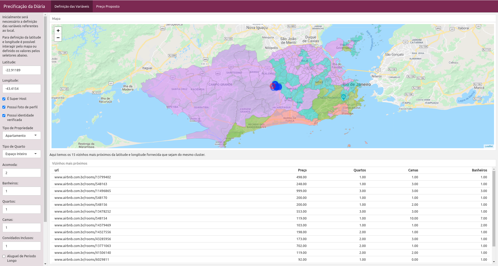

# Resultados

```{r conf_resultados, include=FALSE}
library(magrittr)
library(patchwork)
library(tidyverse)
library(recipes)
library(ranger)
library(rsample)
library(yardstick)
library(rmarkdown)
library(skimr)
library(corrplot)

kable <- function(data, caption = "", fonte = "O próprio autor", ...){ 
  knitr::kable(
    data, "latex", caption = caption, digits = 2, 
    format.args = list(decimal.mark = ",", big.mark = "."), ...
  ) %>% 
  kableExtra::footnote(
    general = fonte, 
    general_title = "Fonte: ", 
    footnote_as_chunk = T
  )
}

format_money = function(x, n=0){
  x = format(x, digits = 2, nsmall=2, big.mark=".", decimal.mark=",", scientific=FALSE)
  qtd_space = if_else(n>str_length(x), n-str_length(x), 0)
  spaces = sapply(qtd_space, function(x){paste0(rep(" ", x), collapse = "")})
  paste0("R$", spaces, x) 

  # str_replace(sprintf('R$ %9.2f',x), "\\.", ",")
}

set.seed(2108)
ggplot2::theme_set(ggplot2::theme_bw())
knitr::opts_chunk$set(echo = F, include = F, message = F, warning = F)
```

Este capítulo apresenta os resultados das análises descritivas dos valores das propriedades e também um detalhamento sobre as propriedades dispostas geograficamente. Além disso, é também retratado neste capítulo os modelos ajustados através do método de Regressão Múltipla e Random Forest para previsão do valor da diária, juntamente com a análise de diagnóstico da qualidade do ajuste obtido.

## Análise Descritiva

```{r}
bairros = readRDS("../output/bairros_fim.rds")

wss = purrr::map_dbl(
  1:10,
  function(x){
    kmeans(bairros %>% select(-c(zona, subprefeitura, bairro, cluster)), x)$tot.withinss
  }
) %>%
  tibble(Withinss=.) %>%
  ggplot() +
  geom_point(aes(x=1:10, y=Withinss)) +
  geom_line(aes(x=1:10, y=Withinss))+
  scale_x_continuous(breaks = 1:10)+
  labs(x="Quantidade de Clusters", y="Variação Total Dentro do Cluster")
```

```{r le_ajusta_base, warning=F, message=F}
ajusta_numero = function(string){
  string %>% str_remove_all("\\$|\\,")  %>% as.double() %>% return()
}

df_ = read_csv("../input/listings.csv", col_types = cols()) %>% 
  mutate(price = ajusta_numero(price)) %>% 
  inner_join(bairros, by = c("neighbourhood_cleansed"="bairro")) #df original

df = readRDS("../output/df.rds") #df filtrado e transformado

resumo_bairros = df_ %>% 
  group_by(neighbourhood_cleansed, cluster, zona, subprefeitura) %>% 
  summarise(
    quantidade_alugueis = n(),
    preco_mediano = median(price),
    preco_medio = mean(price),
    preco_maximo = max(price),
    esperanca_vida = mean(esperanca_vida),
    tx_alfabetizacao_adulta = mean(tx_alfabetizacao_adulta),
    tx_frequencia_escolar = mean(tx_frequencia_escolar),
    renda_per_capita = mean(renda_per_capita),
    idh_longevidade = mean(idh_longevidade),
    idh_educacao = mean(idh_educacao),
    idh_renda = mean(idh_renda),
    idh = mean(idh)
  )

map = sf::read_sf("../output/neighbourhoods.geojson") %>% select(-neighbourhood_group)
map = left_join(map, resumo_bairros, by = c("neighbourhood"="neighbourhood_cleansed"))
```

Com o objetivo de compreender melhor os fenômenos que impactam nos preços das diárias, foi realizada a análise exploratória. A base principal de aluguéis possui 35.793 observações de 106 variáveis. Após a remoção de variáveis que não são relevantes para o objetivo do estudo ou que não possuem variabilidade, além da retirada de observações com valores faltantes na variável resposta (apenas 7 observações), passamos a contar com `r ncol(df)` variáveis, sendo 9 delas criadas que serão comentadas neste capítulo. O detalhamento desses campos se encontra no apêndice na Tabela \ref{tab:desc_variaveis}.

Pelas estatísticas descritivas da variável preço na Tabela \ref{tab:preco_com_outlier} é possível notar uma forte assimetria nos dados. Além disso, é possível notar valores exorbitantes, e por isso, serão removidos alugueis que estejam acima do limite superior (LS = Quantil 75% + 1.5(Quantil 75% - Quantil 25%)).

```{r preco_com_outlier, include = T}
df_ %>% 
  # group_by(cluster) %>% 
  summarise(
    `Média` = mean(price), 
    `Quantil 5%` = quantile(price, .5),
    `Quantil 25%` = quantile(price, .25), 
    `Quantil 75%` = quantile(price, .75), 
    `Quantil 90%` = quantile(price, .9), 
    `Quantil 95%` = quantile(price, .95), 
    `Quantil 99%` = quantile(price, .99), 
    `Quantil 100%` = quantile(price, 1),
    `Limite Superior` = `Quantil 75%` + 1.5 * (`Quantil 75%` - `Quantil 25%`)
  ) %>% mutate_all(~format_money(.x, 11)) %>% 
  t() %>%
  kable(caption = "Distribuição da variável preço", align = c("r"))
```

Para avaliar a distribuição da variável resposta (preço da diária), utilizou-se um histograma e um gráfico conhecido como QQplot, onde são comparados os quantis da variável com os quantis teóricos de uma distribuição, que neste caso será a distribuição normal, por se tratar de uma distribuição simétrica, além da haver a suposição de normalidade dos erros, uma combinação linear da variável resposta. Com auxilio da Figura \ref{dist_preco}, mesmo removendo as propriedades acima do limite superior, ainda é possível notar uma assimetria. Como em todas as variáveis relacionadas a preço, é comum que possua uma grande quantidade de valores pequenos e poucos casos com valores elevados. Medidas como correlação e média podem ser bastante influenciadas por valores extremos e outliers. Para contornar essa influencia foi utilizada a transformação de Box-Cox para que a distribuição da variável em análise seja simétrica e por consequência mais próxima da distribuição normal.

```{r}
bc = MASS::boxcox(price~1, data=df)
bc$lambda = bc$x[which.max(bc$y)]
bc$transform = function(x){
  (x^bc$lambda-1)/bc$lambda
}
bc$inverse = function(x){
  (x*bc$lambda+1)^(1/bc$lambda)
}

# saveRDS(bc, "../output/bc.rds")
```

```{r dist_preco, include = T, fig.cap="\\label{dist_preco}Distribuição dos preços"}
g1 = ggplot(df, aes(x=price)) + geom_histogram() + labs(x="Preço", y="Quantidade") #+ ggtitle("Distribuição do preço") 
g2 = ggplot(df, aes(sample=price)) + stat_qq() + stat_qq_line() + labs(x="Quantil teórico", y="Quantil da amostra") #+ ggtitle("QQPlot")

g3 = ggplot(df, aes(x=bc$transform(price))) + geom_histogram() + labs(x="Preço Transformado", y="Quantidade") # ggtitle("Distribuição do preço transformado")
g4 = ggplot(df, aes(sample=bc$transform(price))) + stat_qq() + stat_qq_line() + labs(x="Quantil teórico", y="Quantil da amostra") #+ ggtitle("QQPlot")

(g1 | g2)/(g3 | g4)
```

Com os dados extraídos do site Data Rio, foi utilizado o algoritmo k-means para separar os bairros de acordo com a similaridade entre eles. Com base na variação total dentro do cluster e utilizando o método “cotovelo”, foi definida a utilização de 4 clusters, pois a partir do quinto, o ganho de performance é relativamente pequeno como pode ser visto na Figura \ref{wss}. Verificou-se que bairros com melhores índices relacionados a educação e economia estão no primeiro cluster, declinando até o quarto. A lista detalhada dos bairros por clusters se encontra no apêndice na Tabela \ref{tab:cluster_bairros}, mas para uma melhor representação, podemos verifica-los geograficamente na Figura \ref{clusters_bairros}.

```{r wss, include = T, fig.cap="\\label{wss}Variação total dentro do cluster", fig.height = 3, fig.width = 5}
wss
```

```{r clusters_bairros, include = T, fig.cap="\\label{clusters_bairros}Clusters dos bairros do Rio de Janeiro"}
ggplot() + 
  geom_sf(data = map %>% mutate(cluster = as.factor(cluster)),
          aes(fill=cluster))
```

Há uma maior distribuição da quantidade de locações pelas zonas sul e central, com um maior preço mediano também (Figura \ref{dist_preco_espaco}). Podemos notar pela Figura \ref{boxplot_cluster} que a distribuição dos preços por clusters, de acordo com o bloxplot, decaem com relação à “qualificação” de cada cluster, exceto para o último cluster. Com uma análise mais precisa, com auxílio da Tabela \ref{tab:resumo_cluster} e da Tabela \ref{tab:cluster_bairros}, notou-se que se trata de um cluster com o maior número de bairros. Além disso, por ser tratar de um cluster menos "qualificado" de acordo com os índices já citados, esperávamos que houvesse propriedades com valores menores que os demais clusters. Porém o comportamento não foi o esperado, já que os valores de quartis (primeiro e terceiro) e limites (inferior e superior) foram maiores que alguns clusters mais desenvolvidos. Apesar de haver uma grande quantidade de bairros, o quarto cluster tem o menor número de observações (locações) na base estudada (aproximadamente 11%), o que pode ter influenciado por valores extremos o “mal” comportamento em relação aos outros grupos. Como o quarto cluster possui uma distribuição não esperada, será criado uma variável binária ao qual identifica os bairros pertencentes desse grupo.

```{r dist_preco_espaco, include = T, fig.cap="\\label{dist_preco_espaco}Distribuição dos preços no espaço"}
gg = df %>%
  mutate(price = log(price)) %>%
  ggplot() +
  geom_sf(data = map %>% mutate(cluster = as.factor(cluster)), fill = NA) +
  geom_point(aes(x = longitude, y = latitude, color = price), alpha=.3) +
  scale_color_gradient(low = "lightgreen", high = "black") +
  labs(color = "Log(Preço)")

ggExtra::ggMarginal(gg, type = "histogram")
```

```{r boxplot_cluster, include = T, fig.cap="\\label{boxplot_cluster}Distribuição dos preços por cluster", fig.height = 3, fig.width = 5}
calc_stat <- function(x) {
  stats <- quantile(x, probs = c(0.1, 0.25, 0.5, 0.75, 0.9))
  names(stats) <- c("ymin", "lower", "middle", "upper", "ymax")
  return(stats)
}

df %>% 
  ggplot(aes(group=cluster, x=cluster, y=price, fill=cluster))+
  stat_summary(fun.data = calc_stat, geom="boxplot") +
  # geom_boxplot() +
  scale_x_continuous(breaks = 1:6) +
  theme(legend.position = "none") + 
  labs(y="Preço")
```

```{r resumo_cluster, include = T, message=FALSE}
resumo_cluster = df %>%
  group_by(cluster) %>%
  summarise(
    `Qtd` = n(),
    `Preço Mediano` = median(price),
    `Preço Médio` = mean(price),
    `Acomoda` = mean(accommodates),
    `Banheiros` = mean(bathrooms),
    `Quartos` = mean(bedrooms),
    `Camas` = mean(beds)
  ) %>% mutate_at(vars("Preço Mediano", "Preço Médio"), ~format_money(.x, n=7))

resumo_cluster %>% kable(caption = "Descritiva dos clusters", align = rep("r", 8))
```

<!-- Com a Figura \ref{dist_casas_bairro} podemos notar que a maior parte dos bairros possuem uma quantidade pequena de casas para alugar. -->

<!-- Podemos notar pela Figura \ref{boxplot_cluster} que as medidas descritivas(1º quartil, mediana e 3º quartil) decaem com relação a "qualificação" do cluster, menos para o último cluster que possui medidas entre o primeiro e segundo clusters, a Tabela \ref{tab:resumo_cluster} apresenta a média das variáveis para cada cluster e é possível notar que a casa média do último cluster se posiciona entre o primeiro e terceiro cluster. É possível que na modelagem a variável que identifica o cluster não seja relevante pois é uma combinação das variáveis de origem do Data.RIO, como o cluster 4 possuí uma distribuição não esperada, será criada um identificador destes bairros. -->

<!-- Levando em conta uma análise das variáveis numéricas, notam-se muitos outliers como visto na Figura \ref{boxplot_numericas}, e por isso, houve uma verificação e um estudo dos casos para que esses valores não influenciassem na análise, pois apesar de poucas quantidades, há diversas locações ditas como “salão de festa”. Como exemplo na Figura \ref{airbnb_festa}, uma locação que acomoda a maior quantidade de pessoas dita como “casa de festa”, sendo possível um número máximo de 160 pessoas como mostrado na Tabela \ref{tab:exemplo_festa}. -->

<!-- ```{r boxplot_numericas, include = T, fig.cap="\\label{boxplot_numericas}Boxplot das variáveis numéricas", fig.height = 3, fig.width = 5} -->
<!-- df %>% -->
<!--   select(accommodates,guests_included, bathrooms,bedrooms,beds) %>% -->
<!--   `colnames<-`( -->
<!--     c("Acomoda", "Pessoas Inclusas", "Banheiros", "Quartos", "Camas") -->
<!--   ) %>% -->
<!--   gather(variavel, valor) %>% -->
<!--   ggplot(aes(x=valor, group=1)) + geom_boxplot() + facet_wrap(~variavel, scales = "free") -->
<!-- ``` -->

<!-- ```{r} -->
<!-- df %>% -->
<!--   select( -->
<!--     id,accommodates,guests_included,price,bathrooms,bedrooms,beds,minimum_nights,maximum_nights -->
<!--   ) %>% -->
<!--   arrange(desc(price)) -->
<!-- ``` -->

<!-- ```{r} -->
<!-- df %>% -->
<!--   select( -->
<!--     id,accommodates,guests_included,price,bathrooms,bedrooms,beds,minimum_nights,maximum_nights -->
<!--   ) %>% -->
<!--   arrange(desc(accommodates)) -->
<!-- ``` -->

<!-- {height=40%} -->

<!-- ```{r exemplo_festa, include = T} -->
<!-- df %>% -->
<!--   transmute( -->
<!--     url=paste0("https://www.airbnb.com/rooms/",id),accommodates,guests_included,bathrooms, -->
<!--     bedrooms,beds,minimum_nights,maximum_nights -->
<!--   ) %>% -->
<!--   `colnames<-`( -->
<!--     c("Url", "Acomoda", "Pessoas Inclusas", "Banheiros", "Quartos", "Camas", -->
<!--       "Quantidade de Noites Mínima", "Quantidade de Noites Máxima") -->
<!--   ) %>% -->
<!--   arrange( -->
<!--     desc(Acomoda) -->
<!--   ) %>% .[1,] %>% t() %>% -->
<!--   kable(caption = "Exemplo de casa de festas") %>%   kableExtra::column_spec(2, width = "10cm") -->
<!-- ``` -->

Na Tabela \ref{tab:minimum_nights} são apresentados os quantis da quantidade mínima de noites para o aluguel da propriedade. A Figura \ref{fig:minima_noites}, no apêndice, é um exemplo de uma locação com uma quantidade mínima de dias discrepante. A intenção é a predição de aluguéis de propriedades a curto/médio prazo, então foram removidos os casos onde a quantidade mínima de noites são maiores que 365 dias (um total de 17 observações). Além disto, segundo o próprio @airbnbperiodolongo, todas as reservas de um mês ou mais podem ser consideradas reservas de longa duração. Criou-se, então, uma variável que identifique os aluguéis de períodos curtos ou longos, para posteriormente verificar se há influência nos modelos. 

```{r minimum_nights, include = T}
df %>% 
  summarise(
    Mediana = quantile(minimum_nights, .5),
    # `Quantil 75%` = quantile(minimum_nights, .75),
    # `Quantil 80%` = quantile(minimum_nights, .8),
    # `Quantil 90%` = quantile(minimum_nights, .9),
    # `Quantil 95%` = quantile(minimum_nights, .95),
    # `Quantil 99%` = quantile(minimum_nights, .99),
    `Quantil 99.9%` = quantile(minimum_nights, .999),
    `Máximo` = max(minimum_nights)
  ) %>% t() %>% 
  kable(caption = "Quantis de quantidade mínima de dias")
```

```{r}
df %>% 
  select(
    id,accommodates,guests_included,price,bathrooms,bedrooms,beds,minimum_nights,maximum_nights
  ) %>% 
  arrange(desc(minimum_nights))
```

Na central de ajuda do próprio site @precoairbnb é evidenciado que a escolha do valor da propriedade é somente do proprietário. Contudo, a empresa sugere uma busca por espaços parecidos com a propriedade oferecida, seja no bairro ou na cidade, para ter uma ideia dos valores do mercado. Com isso, foram criadas variáveis de acordo com os 15 vizinhos mais próximos dentro do mesmo cluster utilizando a distância euclidiana, como exemplificado na Figura \ref{vizinhos}. A escolha dos vizinhos dentro do mesmo cluster foi realizada para não haver influência de clusters mais desenvolvidos com clusters menos desenvolvidos ou vice-versa, o que poderia causar um viés na estimação. Então foram criadas as seguintes variáveis: mediana do preço dos vizinhos, quantidade mediana de quartos, camas e banheiros, além de variáveis que identificam se a propriedade é maior (quantidade de banheiros, quartos e camas) que a mediana dos vizinhos. A ideia inicial era utilizar medidas estatísticas dos próprios bairros como variáveis preditoras, como o próprio Airbnb recomenda em sua página, porém há bairros com poucas propriedades, como pode ser visto na Tabela \ref{tab:top_10_bairros}, o que poderia não retratar bem a realidade.

```{r top_10_bairros, include = T}
map %>% as_tibble() %>% 
  arrange(desc(preco_mediano)) %>% 
  select(neighbourhood, quantidade_alugueis, preco_mediano, preco_medio, preco_maximo) %>% 
  `colnames<-`(c("Bairro", "Qtd", "Preço Mediano", "Preço Médio", "Preço Máximo")) %>% 
  mutate_at(vars("Preço Mediano", "Preço Médio", "Preço Máximo"), ~format_money(.x, 9)) %>% 
  head(10) %>% 
  kable(caption = "Dez bairros com maiores medianas de preço", align=c("l", "r", "r", "r", "r"))
```

```{r vizinhos, include = T, fig.cap="\\label{vizinhos}Vizinhos mais próximos", fig.height = 3, fig.width = 5}
df_near = readRDS("../output/near.rds") %>% filter(id==3061049) %>% unnest(data)

ggplot() +
  geom_sf(data = map %>% mutate(cluster = as.factor(cluster)),
          aes(fill=cluster)) +
  coord_sf(ylim = c(-23.07, -22.8), xlim = c(-43.8, -43.4)) +
  geom_point(data=df_near, aes(x=longitude,y=latitude), color="red", alpha=.8) +
  geom_point(data=df_near, aes(x=longitude.y,y=latitude.y), color="blue", alpha=.6)
```

## Modelagem

```{r}
metric = metric_set(rmse, mae, mape, rsq)
```

```{r}
prop = .7
split = initial_split(df, prop)
train = training(split)
test = testing(split)
```

```{r funcoes_auxiliares}
predict_mod = function(x, mod = NULL, pred_fun=predict){
  if(is.null(mod)){
    pred = x$price_near
  }else{
    pred = pred_fun(mod, x) 
  }
  
  if(typeof(pred) != "double"){
    if(".pred" %in% names(pred)){
      pred = pred$.pred
    }
    else{
      pred = pred$predictions
    }
  }
  
  max_pred = quantile(pred, .995)
  return(
    tibble(
      .pred = if_else(pred > max_pred, max_pred, pred)
      # .pred = pred
    )
  )
}

testa_modelo = function(df, modelo, pred_fun = predict){
  tibble(
    id = df$id,
    x = 1:nrow(df), 
    
    pred = predict_mod(df, modelo, pred_fun)$.pred,
    pred_inv = bc$inverse(pred),
    
    price = bc$transform(df$price),
    price_inv = df$price,
    
    resid = price - pred,
    resid_inv = price_inv - pred_inv
  )
}

extrai_metricas = function(testa, truth = price_inv, estimate = pred_inv){
  testa %>% 
    metric(truth = {{truth}}, estimate = {{estimate}}) %>% 
    transmute(
      `Métrica` = case_when(
        .metric == "mae" ~ "EAM",
        .metric == "mape" ~ "EPAM",
        .metric == "smape" ~ "EPAMS",
        .metric == "rmse" ~ "REQM",
        .metric == "rsq" ~ "R2",
        .metric == "Fora da Amostra" ~ "OOB"
      ),
      Estimativa = .estimate
    )
}

metricas = function(treino, teste, truth = price_inv, estimate = pred_inv){
  extrai_metricas(treino, truth = {{truth}}, estimate = {{estimate}}) %>% 
    mutate(`Base` = "Treino") %>% 
    bind_rows(
      extrai_metricas(teste, truth = {{truth}}, estimate = {{estimate}}) %>% 
        mutate(`Base` = "Teste")
    ) %>% 
    transmute(
      `Base`, `Métrica`, Estimativa
    )
}

rename_ = function(col){
  case_when(
      col == "host_is_superhost" ~ 'É superhost',
      col == "host_has_profile_pic" ~ 'Possui foto de perfil',
      col == "host_identity_verified" ~ 'Possui indentidade verificada',
      col == "latitude" ~ 'Latitude',
      col == "longitude" ~ 'Longitude',
      grepl("property_type", col) ~ str_replace(col, "property_type", "Tipo de propriedade "),
      grepl("room_type", col) ~ str_replace(col, "room_type", "Tipo de quarto "),
      grepl("subprefeitura", col) ~ str_replace(col, "subprefeitura", "Subprefeitura "),
      col == "accommodates" ~ 'Acomoda',
      col == "bathrooms" ~ 'Banheiros',
      col == "bedrooms" ~ 'Quartos',
      col == "beds" ~ 'Camas',
      col == "guests_included" ~ 'Pessoas Inclusas',
      grepl("cancellation_policy", col) ~ str_replace(col, "cancellation_policy", "Politica de Cancelamento "),
      col == "subprefeitura" ~ 'Subprefeitura',
      col == "esperanca_vida" ~ 'Esperança de Vida',
      col == "tx_alfabetizacao_adulta" ~ 'Taxa de Alfabetização Adulta',
      col == "tx_frequencia_escolar" ~ 'Taxa de Frequência Escolar',
      col == "renda_per_capita" ~ 'Renda per Capita',
      col == "idh_longevidade" ~ 'IDH Longevidade',
      col == "idh_educacao" ~ 'IDH Educação',
      col == "idh_renda" ~ 'IDH Renda',
      col == "idh" ~ 'IDH',
      col == "fl_extra_people" ~ 'Cobra por pessoa a mais',
      col == "cluster_4" ~ 'É do Cluster 4',
      col == "price_near" ~ 'Preço Vizinhos',
      col == "bedrooms_near" ~ 'Quartos Vizinhos',
      col == "beds_near" ~ 'Camas Vizinhos',
      col == "bathrooms_near" ~ 'Banheiros Vizinhos',
      col == "fl_mais_banheiros" ~ 'Mais Banheiros Vizinhos',
      col == "fl_mais_quartos" ~ 'Mais Quartos Vizinhos',
      col == "fl_mais_camas" ~ 'Mais Camas Vizinhos',
      col == "price" ~ 'Preço',
      col == "fl_periodo_longo" ~ 'É Longo Periodo',
      col == "minimum_nights" ~ "Mínimo de noites",
      col == "maximum_nights" ~ "Máximo de noites",
      TRUE ~ col
    )
}
```

```{r}
testa_variavel = function(df, df2, ...){
  left_join(
    df %>%
      left_join(df2 %>% select(id, pred_inv, price_inv), by = "id") %>%
        group_by(...) %>%
        metric(truth = price_inv, estimate = pred_inv) %>%
        select(..., .metric, .estimate) %>%
        spread(.metric, .estimate),
    df %>% count(...),
    #by = ...
  )
}
```

```{r}
rec = recipe(price ~ ., data = train) %>% 
  step_filter(
    minimum_nights<=365
  ) %>% 
  step_mutate(
    fl_periodo_longo = if_else(minimum_nights>30,1,0),
    cancellation_policy = as.character(cancellation_policy),
    cancellation_policy = case_when(
      grepl("strict", cancellation_policy) ~ "strict",
      TRUE ~ cancellation_policy
    ),
  ) %>% 
  step_other(
    property_type, other = "Other"
  ) %>% 
  step_rm(
    zona, cluster
  ) %>% 
  prep()

train_ = juice(rec)
```

Como temos um conjunto consideravelmente grande, para termos uma ideia da performance dos modelos, a base de dados foi dividida em dois pedaços: uma para treinar o modelo, com `r paste0(prop*100, "%")` dos dados (`r nrow(train)` observações), e outra para teste, com os `r paste0((1-prop)*100, "%")` restantes (`r nrow(test)` observações).

```{r correlacao_variaveis, include = T, fig.cap="\\label{correlacao_variaveis}Correlação entre variáveis"}
c = cor(
    train %>% 
      select(where(is.numeric), -contains("fl") , -cluster_4, -cluster, -id) %>% 
      `colnames<-`(., rename_(colnames(.)))
  )
corrplot(
  c, type = "lower", tl.col = "black", tl.srt = 360, tl.cex = .6, tl.offset=.5,
  method = "square", diag = F, order = "original")
```

Ao cruzar as bases de dados utilizadas na análise, pela Figura \ref{correlacao_variaveis} é possível notar grandes correlações entre as variáveis da mesma base de dados (Data Rio). Comparando variáveis de bases diferentes, há uma correlação significativa ao comparar a *Longitude* com os *Índices de Desenvolvimento Humano (IDH)*, nos dando uma ideia de que há áreas que realmente são mais desenvolvidas, o que pode ser uma variável importante para a análise. Além disso, há uma correlação significativa e positiva do preço com as variáveis de quantidade de quartos, banheiros e capacidade de acomodação, nos dando uma ideia de que quanto maior a propriedade, mais cara ela se torna.

Como a variável "IDH" é uma combinação de outros tipos de índices (longevidade, educação e renda)^[http://www.atlasbrasil.org.br/2013/pt/o_atlas/idhm/], caracteriza-se problema de multicolinearidade. O mesmo se pode dizer com a variável "IDH de educação" com as variáveis "taxas de frequência escolar" e "alfabetização adulta". Com isso, vamos considerar apenas as variáveis "originais", ou seja, variáveis sem qualquer tipo de combinação. Além disto, foram verificadas as variáveis com o mesmo problema utilizando o VIF (*variance inflation factor*) como método.  Na Tabela \ref{tab:vif} é apresentada as variáveis com os maiores índices de inflação.

```{r}
rec_rm = rec %>% step_rm(
  idh_educacao, idh_renda, idh_longevidade, idh, minimum_nights, maximum_nights
) %>% prep()

train_ = juice(rec_rm)
```

```{r vif, include = T}
vif = lm(
  price~.,
  train_ %>% 
    select(-id, -neighbourhood_cleansed) %>% #, -tx_alfabetizacao_adulta, -esperanca_vida, -longitude, -tx_frequencia_escolar) %>% 
    mutate(price=bc$transform(price))
  ) %>% car::vif() %>% as.data.frame() %>% arrange(desc(`GVIF^(1/(2*Df))`))

vif$Variavel = rename_(rownames(vif))


vif %>% as_tibble() %>% transmute(Variavel, VIF=GVIF) %>% slice(1:7) %>% 
  kable(caption = "VIF")
```

Alguns autores, como, por exemplo, @chatterjee2006analysis e @petrini2012degree, sugerem que, se qualquer VIF exceder 10 (o que acontecerá se a correlação entre as variáveis regressoras for maior que 0,90), então a multicolinearidade causará efeitos nos coeficientes de regressão. Com isso, foram retiradas as variáveis `r stringi::stri_replace_last(paste(rename_(c('tx_alfabetizacao_adulta', 'esperanca_vida', 'longitude', 'tx_frequencia_escolar')), collapse = ", "), ' e', fixed=',')`, pois apresentaram um fator acima da referencia escolhida ($VIF>10$). Após a remoção das possíveis variáveis com o problema de multicolinearidade, a Tabela \ref{tab:vif_final} apresenta as variáveis de maiores VIFs, o que não representa mais um problema.

```{r vif_final, include=T}
vif = lm(
  price~.,
  train_ %>% 
    select(
      -id, -neighbourhood_cleansed, -tx_alfabetizacao_adulta, -esperanca_vida, -longitude, -tx_frequencia_escolar
    ) %>% 
    mutate(price=bc$transform(price))
  ) %>% car::vif() %>% as.data.frame() %>% arrange(desc(`GVIF^(1/(2*Df))`))

vif$Variavel = rename_(rownames(vif))

vif %>% as_tibble() %>% transmute(Variavel, VIF=GVIF) %>% slice(1:7) %>% 
  kable(caption = "VIF pós remoção")
```

```{r}
rec_rm %<>% step_rm(
  tx_alfabetizacao_adulta, esperanca_vida, longitude, tx_frequencia_escolar
) %>% prep()

train_ = juice(rec_rm)
test_ = bake(rec_rm, test)
```

### Modelo baseline

Somente para efeitos comparativos, será criado um modelo *baseline*, onde a previsão será  o preço mediano dos 15 vizinhos mais próximos, já que, como explicado, @precoairbnb sugere uma busca por espaços parecidos da propriedade oferecida na sua cidade ou bairro, para ter uma ideia dos valores. Como a pesquisa está sendo realizada na cidade do Rio de Janeiro, optamos por utilizar os vizinhos próximos, desde que estejam no mesmo cluster, para não haver uma influência de qualificação do bairro de acordo com os índices já citados no capítulo de análise exploratória.

```{r}
modelo_base_train = testa_modelo(juice(rec), NULL)
modelo_base_test = testa_modelo(bake(rec, test), NULL)
```

```{r base_metricas, include=T}
baseline_metricas = metricas(modelo_base_train, modelo_base_test, truth = price_inv, estimate = pred) 
# baseline_metricas %>% kable(caption = "Estimativa do erro destransformado para o modelo baseline")
```

### Modelos Lineares

Encontradas as estimativas dos coeficientes $\beta$'s, é necessário validar o modelo de regressão, que consiste em verificar se as variáveis fazem sentido no contexto do fenômeno estudado, que pode ser feito através do teste t de Student como será apresentado na análise dos resultados [@werkema1996analise]. Utilizando um nível de significância de 5%, verifica-se pela Figura \ref{significancia_ml} a significância de cada variável, onde os pontos cinzas relacionadas ao coeficientes das variáveis não relevantes serão removidas pelo teste de significância, os pontos azuis são relacionadas aos coeficientes das variáveis que possuem efeitos positivos (afetam positivamente no preço previsto) e as vermelhos são aquelas que possuem coeficientes negativos (afetam negativamente no preço previsto).

As variáveis relacionadas aos pontos coloridos que estão com p-valor acima do nível de significância foram mantidas, pois trata-se de categorias significativas de algumas variáveis categóricas. Sendo assim, foi decidido que haveria boa relevância para os modelos e, com isso, não seriam removidas.

```{r significancia_ml, include = T, fig.cap="\\label{significancia_ml}Significância das variáveis no modelo linear"}
lm0 = lm(
  price~., 
  train_ %>% 
    mutate(price=bc$transform(price)) %>% 
    select(
      -id, -neighbourhood_cleansed
    )
)

lm_coef = summary(lm0)$coefficients 
rownames(lm_coef) = rename_(rownames(lm_coef))

sum_lm0 = summary(lm0) %>%
  tidy() %>%
  filter(term != "(Intercept)") %>%
  mutate(
    color = if_else(
      term %in% c("bathrooms_near", "bedrooms_near", "fl_mais_banheiros", "fl_mais_quartos"), "grey", 
      if_else(estimate > 0, "#00BFC4", "#F8766D")
    )
  ) 


sum_lm0 %>% 
  ggplot() +
  geom_point(
    aes(
      p.value, reorder(rename_(term), p.value), 
      colour = color
    ), show.legend = FALSE
  ) +
  geom_vline(xintercept = 5/100, linetype = 2) +
  scale_color_identity() +
  xlab("p-valor") +
  ylab("")

lm0 = lm(
  price~., 
  train_ %>% 
    mutate(price=bc$transform(price)) %>% 
    select(
      -id, -neighbourhood_cleansed, -bathrooms_near, -bedrooms_near, -fl_mais_banheiros, -fl_mais_quartos
    )
)

```

Além da significância das variáveis comentadas anteriormente, é possível quantificar a importância de cada variável. Para isso, será utilizado o valor absoluto da estatística de teste utilizada para o teste de hipóteses da significância de cada variável. Verifica-se, com isso, as variáveis relevantes em ordem decrescente na Figura \ref{imp_ml}.

```{r imp_ml, include = T, fig.cap="\\label{imp_ml}Importância das variáveis no modelo linear"}
caret::varImp(lm0, scale=F) %>% tibble(variable = rename_(rownames(.)), importance=Overall) %>% 
  ggplot(
    aes(x=reorder(variable,importance), y=importance,fill=importance)
  ) + 
  geom_bar(stat="identity", position="dodge")+ coord_flip()+
  ylab("Importância da variável")+
  xlab("")+
  guides(fill=F)
```

A adequação do modelo é realizada essencialmente por meio dos resíduos do modelo ajustado. Após utilizar a transformação Box-Cox na variável resposta, as Figuras \ref{resid_ml} e \ref{resid_ml_test} mostram gráficos de adequação, com as suposições de normalidade e homocedasticidade dos resíduos aparentemente atendidas pelos dados, tanto na base de teste quanto na de treino.

```{r}
lm_train = testa_modelo(juice(rec), lm0)
lm_test = testa_modelo(bake(rec, test), lm0)
```

```{r resid_ml, include = T, fig.cap="\\label{resid_ml}Resíduos do Modelo Linear na base de treino", fig.height = 3, fig.width = 10}
g1 = lm_train %>% ggplot(aes(x=resid)) + geom_histogram() + labs(x="Resíduos", y="Quantidade")
g3 = lm_train %>% ggplot(aes(sample=resid)) + stat_qq() + stat_qq_line() + labs(x="Quantil teórico", y="Quantil Amostra")
(g1|g3)
```

```{r resid_ml_test, include = T, fig.cap="\\label{resid_ml_test}Resíduos do Modelo Linear na base de teste", fig.height = 3, fig.width = 10}
g1 = lm_test %>% ggplot(aes(x=resid)) + geom_histogram() + labs(x="Resíduos", y="Quantidade")
g3 = lm_test %>% ggplot(aes(sample=resid)) + stat_qq() + stat_qq_line() + labs(x="Quantil teórico", y="Quantil Amostra")
(g1|g3)
```

Após isso, precisou verificar a previsão na escala original. Com isso, foi aplicado uma transformação inversa na predição do preço para uma melhor avaliação do modelo. Verifica-se, na Figura \ref{resid_ml_inv}, uma maior concentração dos resíduos em torno do zero, com uma leve assimetria. Apesar de um grande número de previsões com baixo erro, o modelo subestima algumas propriedades, já que os valores reais são, em pequenas quantidades, desvalorizadas pelo modelo.

```{r resid_ml_inv, include = T, fig.cap="\\label{resid_ml_inv}Resíduos do Modelo Linear com Transformação Inversa", fig.height = 3, fig.width = 10}
g1 = lm_train %>% 
  ggplot(aes(x=resid_inv)) + 
  geom_histogram() + 
  labs(x="Resíduos", y="Quantidade") + 
  ggtitle("Base de treino")

g2 = lm_test %>% 
  ggplot(aes(x=resid_inv)) + 
  geom_histogram() + 
  labs(x="Resíduos", y="Quantidade") + 
  ggtitle("Base de teste")
(g1|g2)
```

```{r lm_metricas, include=T}
lm_metricas = metricas(lm_train, lm_test) 
lm_metricas %>% kable(caption = "Estimativa do erro destransformado para o Modelo Linear")
```

A Figura \ref{graf_resid_ml} é dividida em dois gráficos: o gráfico superior representa o EPAM para cada faixa de preço e a parte inferior representa a quantidade de propriedades também pela faixa de preço. Com isso, pode-se proferir que o método apresenta um nível não confiável para preços baixos ($\leq$ R$51,00), visto que seu EPAM foi de 239,5, ou seja, 239,5% de erro percentual. E não há uma relação entre a quantidade de propriedades com o EPAM, já que há grandes erros relacionados as faixas com muitas ou poucas propriedades, como por exemplo nas duas primeiras faixas de preço.

```{r}
df %>% filter(id == "4905942") %>% glimpse()
```

```{r}
df %>% count(property_type) %>% arrange(desc(n))
```

```{r}
df %>% count(room_type) %>% arrange(desc(n))
```

```{r graf_resid_ml, message=F, include = T, fig.cap="\\label{graf_resid_ml}Distribuição dos resíduos do Modelo Linear"}
aux <- test %>% mutate(
  preco = cut(
    price, 
    breaks = c(seq(1,1500,50), 1500)
  )
)

aux <- aux %>% testa_variavel(., lm_test, preco)

transparencia = .3

(
  aux %>% ggplot(aes(x=preco)) + 
    geom_point(aes(y=mape)) + 
    geom_hline(yintercept = 25, linetype="dashed", alpha = transparencia) +
    geom_hline(yintercept = 50, linetype="dashed", alpha = transparencia) +
    geom_hline(yintercept = 100, linetype="dashed", alpha = transparencia) +
    geom_hline(yintercept = 150, linetype="dashed", alpha = transparencia) +
    geom_hline(yintercept = 200, linetype="dashed", alpha = transparencia) +
    theme(axis.title.x=element_blank(),
          axis.text.x=element_blank(),
          axis.ticks.x=element_blank()) +
    ylab("EPAM")
) / (
  aux %>% ggplot(aes(x=preco)) + 
    geom_col(aes(y=n), fill="black", alpha=.8) +
    theme(axis.text.x = element_text(angle = 90, vjust = 0.5, hjust=1)) +
    ylab("Quantidade") + xlab("Preço")
)
```

#### Regularização

Neste capítulo será testada a regularização LASSO, que é utilizada para seleção de variáveis. Serão utilizadas as variáveis que foram removidas (seja por significância ou multicolinearidade), de forma a compararmos a forma de seleção utilizando este método e o método "manual". Um estimador com base em apenas um subconjunto das variáveis explicativas tem ainda mais motivos para ter uma performance boa: são comuns os problemas em que esperamos que algumas das covariáveis não influenciem (ou influenciem pouco) a variável resposta.

Cada valor do parâmetro $\lambda$ leva a um conjunto de coeficientes estimados diferentes, e o mesmo foi escolhido pela validação cruzada neste trabalho. O mesmo pode variar entre aproximadamente 0,0002 e 0,3, Para mais detalhes, ver @friedman2010regularization.

```{r message=F}
X = juice(rec) %>% 
  mutate(price = bc$transform(price)) %>% 
  select(-c(id, neighbourhood_cleansed, 
            # idh_educacao, idh_renda, idh_longevidade, idh, 
            # tx_alfabetizacao_adulta,
            # esperanca_vida, longitude, tx_frequencia_escolar,
            # bathrooms_near, bedrooms_near,
            # fl_mais_banheiros, fl_mais_quartos
            )
  )
y = X$price
X = X %>% model.matrix(price ~ 0 + ., .)

alpha = 1
netcv = glmnet::cv.glmnet(X, y, nfolds = 10, alpha=alpha, parallel = T, seed = 2108)
```

Na Figura \ref{lasso_lambda} é apresentado o resultado da validação cruzada e no topo da mesma é apresentada a quantidade de variáveis selecionadas pelo algoritmo LASSO. 

<!-- Escolhendo alguns $\lambda$'s como exemplo, espera-se que um $\lambda$ maior resulte em coeficientes menores. -->

```{r lasso_lambda, message=F, include = T, fig.cap="\\label{lasso_lambda}Teste de valores do hiperparâmetro", fig.height = 4, fig.width = 10}
nFolds <- 10
foldid <- sample(rep(seq(nFolds), length.out = nrow(X)))
                 
netcv <- glmnet::cv.glmnet(X, y, nfolds = nFolds, foldid = foldid, alpha=alpha, parallel = T)
plot(netcv, ylab='Erro Quadrático Médio')
```

Foi considerado o maior valor de $\lambda$, de modo que o erro esteja dentro de um erro padrão do mínimo, ou seja, será selecionado o $\lambda$ que apresente a quantidade mínima de variáveis de modo que o erro médio na base de teste esteja dentro do intervalo de um desvio padrão. O valor encontrado é 0,0066053.

```{r}
net = glmnet::glmnet(X, y, alpha = alpha, lambda = netcv$lambda.1se)
```

```{r, warning=F}
net_coef = tidy(as.matrix(coef(net)))
rm_lasso = paste(rename_(net_coef[net_coef$s0 == 0,]$.rownames), collapse = ", ") %>% stringi::stri_replace_last(., ' e', fixed=',')
```

Com a regressão de LASSO, os coeficientes de regressão para variáveis sem importância são reduzidos a zero, o que efetivamente as remove do modelo e produz um modelo mais simples que seleciona apenas os preditores mais importantes. Conforme Figura \ref{significancia_lasso}, as variáveis removidas estão sinalizadas com pontos cinzas, enquanto os pontos azuis e vermelhos continuam no modelo, impactando no valor da diária de forma positiva e negativa, respectivamente.

```{r}
rm_multicolinearidade = paste(
  rename_(
    c("idh_educacao", "idh_renda", "idh_longevidade", "idh", "tx_alfabetizacao_adulta", 
      "esperanca_vida", "longitude", "tx_frequencia_escolar")
  ), collapse = ", ") %>%
  stringi::stri_replace_last(., ' e', fixed=',')

rm_significancia = paste(rename_(c("bathrooms_near", "bedrooms_near", "fl_mais_banheiros", "fl_mais_quartos")), collapse = ", ") %>%
  stringi::stri_replace_last(., ' e', fixed=',')
``` 

Sem a utilização do método LASSO, foram removidas as variáveis levando em conta problemas de multicolinearidade (`r rm_multicolinearidade`) e significância (`r rm_significancia`). Com a utilização do método LASSO, foram removidas as variáveis de acordo com a penalização do próprio método (`r rm_lasso`). 

Por se tratar de métodos diferentes para escolha de variáveis regressoras, será ajustado dois modelos lineares para efeitos de comparação: Modelo de Regressão Linear Múltipla com seleção manual das variáveis e Modelo de Regressão Linear Múltipla com seleção das variáveis utilizando LASSO.

```{r significancia_lasso, include = T, fig.cap="\\label{significancia_lasso}Coeficientes das variáveis da regressão Lasso", fig.height = 7, fig.width = 7}
net_coef %>%
  filter(.rownames != "(Intercept)") %>%
  mutate(
    color = if_else(
      s0 == 0, "grey", 
      if_else(s0 > 0, "#00BFC4", "#F8766D")
    )
  ) %>% 
  ggplot() +
  geom_point(
    aes(
      s0, reorder(rename_(.rownames), s0), 
      colour = color
    ), show.legend = FALSE
  ) +
  scale_color_identity() +
  xlab("Coeficiente") +
  ylab("")
```

```{r, warning=F}
select_lasso = net_coef[net_coef$s0 != 0 & net_coef$.rownames != "(Intercept)",]$.rownames

select_lasso = c(
  Filter(
    function(x) !grepl("property_type|cancellation_policy|subprefeitura|room_type", x), 
    select_lasso
  ),
  "property_type", "cancellation_policy", "subprefeitura", "room_type", "price"
)

lm1 = lm(
  price~., 
  juice(rec) %>% 
    mutate(price=bc$transform(price)) %>% 
    select(
      all_of(select_lasso)
    )
) 

vif1 = car::vif(lm1) %>% tidy()
vif1$Variavel = rename_(vif1$.rownames)
```

Cabe ressaltar que a seleção de variáveis via LASSO solucionou o problema existente de multicolinearidade da base de dados, pode-se verificar isso pela Tabela \ref{tab:vif_lasso}.

```{r vif_lasso, include=T}
vif1 %>% 
  transmute(Variavel, VIF=GVIF) %>% 
  arrange(desc(VIF)) %>% slice(1:7) %>% 
  kable(caption = "VIF Lasso")
```

<!-- ```{r importance_net, include = T, fig.cap="\\label{significancia_ml}Importância das variáveis na regressão LASSO"} -->
<!-- caret::varImp(net, lambda = netcv$lambda.1se) %>% tibble(variable = rename_(rownames(.)), importance=Overall) %>%  -->
<!--   filter(importance > 0 ) %>%  -->
<!--   ggplot( -->
<!--     aes(x=reorder(variable,importance), y=importance,fill=importance) -->
<!--   ) +  -->
<!--   geom_bar(stat="identity", position="dodge")+ coord_flip()+ -->
<!--   ylab("Importância da variável")+ -->
<!--   xlab("")+ -->
<!--   guides(fill=F) -->
<!-- ``` -->

```{r}
lasso <- parsnip::linear_reg(penalty = netcv$lambda.1se, mixture = alpha) %>%
  parsnip::set_engine("glmnet") %>%
  parsnip::fit(
    price ~ ., 
    data = juice(rec) %>% mutate(price = bc$transform(price)) %>% 
        select(-c(id, neighbourhood_cleansed))
  )
```

```{r coef_lasso, include = F, fig.cap="\\label{coef_lasso}Coeficientes das variáveis da regressão Lasso"}
plot(lasso$fit, label=T, ylab = "Coeficientes", xvar = "lambda", xlab = expression(Log(lambda)))
```

```{r lasso_treino, include=T}
lasso_train <- testa_modelo(juice(rec), lasso)
lasso_test <- testa_modelo(bake(rec, test), lasso)
```

Assim como nos modelos lineares com a seleção de variáveis utilizando métodos de significância e multicolinearidade, o modelo linear utilizando LASSO também utilizou a transformação Box-Cox na variável resposta. Conforme as Figuras \ref{resid_lasso} e \ref{resid_lasso_test}, as suposições de normalidade e homocedasticidade dos resíduos foram aparentemente atendidas, tanto na base de teste quanto na de treino. 

```{r resid_lasso, include = T, fig.cap="\\label{resid_lasso}Resíduos do Modelo Linear na base de treino", fig.height = 3, fig.width = 10}
g1 = lasso_train %>% ggplot(aes(x=resid)) + geom_histogram() + labs(x="Resíduos", y="Quantidade")
g3 = lasso_train %>% ggplot(aes(sample=resid)) + stat_qq() + stat_qq_line() + labs(x="Quantil teórico", y="Quantil Amostra")
(g1|g3)
```

```{r resid_lasso_test, include = T, fig.cap="\\label{resid_lasso_test}Resíduos do Modelo Linear na base de teste", fig.height = 3, fig.width = 10}
g1 = lasso_test %>% ggplot(aes(x=resid)) + geom_histogram() + labs(x="Resíduos", y="Quantidade")
g3 = lasso_test %>% ggplot(aes(sample=resid)) + stat_qq() + stat_qq_line() + labs(x="Quantil teórico", y="Quantil Amostra")
(g1|g3)
```

Verificou-se também a previsão aplicando uma transformação inversa na predição do preço para uma melhor avaliação do modelo, com auxílio da Figura \ref{resid_lasso_inv}, verifica-se uma maior concentração dos resíduos em torno do zero, com uma leve assimetria. Apesar de um grande número de previsões com baixo erro, o modelo com LASSO também subestima algumas propriedades.

```{r resid_lasso_inv, include = T, fig.cap="\\label{resid_lasso_inv}Resíduos do Modelo Linear com Transformação Inversa", fig.height = 3, fig.width = 10}
g1 = lasso_train %>% 
  ggplot(aes(x=resid_inv)) + 
  geom_histogram() + 
  labs(x="Resíduos", y="Quantidade") + 
  ggtitle("Base de treino")

g2 = lasso_test %>% 
  ggplot(aes(x=resid_inv)) + 
  geom_histogram() + 
  labs(x="Resíduos", y="Quantidade") + 
  ggtitle("Base de teste")
(g1|g2)
```

```{r lasso_metricas, include=T}
lasso_metricas = metricas(lasso_train, lasso_test) 
lasso_metricas %>% kable(caption = "Estimativa do erro destransformado para o LASSO")
```

Comparando a distribuição dos resíduos do modelos linear utilizando as variáveis selecionadas manualmente e via LASSO pelas Figura \ref{resid_ml_inv} e \ref{resid_lasso_inv} é possível notar grande semelhança, para uma melhor comparação, também pode-se comparar as métricas dos erros disponíveis nas Tabelas \ref{tab:lm_metricas} e \ref{tab:lasso_metricas}, também possível notar grande similaridade.

Visto isso, a regressão LASSO se mostrou muito efetiva para contornar problemas de multicolinearidade, como pode ser visto na Tabela \ref{tab:vif_lasso}, e remoção de variáveis não significativas, para que seja e utilizado um modelo mais parcimonioso possível sem perder tanto poder preditivo (aumento dos erros).


### Random Forest

#### Modelo base

Como descrito na metodologia, o modelo Random Forest possui alguns hiperparâmetros, sendo estes definidos por valores fixos. Nesta seção, será analisado o modelo base, ou seja, utilizando os valores dos hiperparâmetros *default* do pacote *ranger* [@wright2015ranger].

```{r}
start_time_rf0 <- Sys.time()
rf0 = ranger(
  data = juice(rec) %>% select(-id, -neighbourhood_cleansed) %>% mutate(price=bc$transform(price))
  , price~., num.threads=4, verbose = F
)
end_time_rf0 <- Sys.time()
```


```{r}
aux = bake(rec, train)

start_time_pred_rf0 <- Sys.time()
aux = predict(rf0, aux)
end_time_pred_rf0 <- Sys.time()
```

Para efeitos de comparação, o treinamento do modelo base levou aproximadamente 13 segundos e a predição da base de treino levou 1,28 segundos, aproximadamente.

```{r}
rf_train0 = testa_modelo(juice(rec), rf0)
rf_test0 = testa_modelo(bake(rec, test), rf0)
```

Na Tabela \ref{tab:rf0_metricas} é possível notar que há um ajuste em excesso no conjunto de dados de treino (menores erros) comparado ao conjunto de dados de teste (maiores erros), podendo por isso ter um mau desempenho preditivo quando aplicados a novos dados, dando indícios de sobreajuste do modelo.

```{r rf0_metricas, include=T}
rf_base_metricas = metricas(rf_train0, rf_test0) 
rf_base_metricas %>% kable(caption = "Estimativa do erro destransformado para o random forest base")
```

#### Hiperparâmetros

Como visto na seção anterior, o modelo *default* parece ter apresentado problema de sobreajuste na base de treino. Com isso, nessa seção abordaremos uma análise e descrição da relação entre os hiperparâmetros do modelo, buscando valores para os mesmos, a fim de melhorar o modelo.

Em geral, uma quantidade elevada de árvores aumenta a performance e torna as predições mais estáveis, mas também torna a computação mais lenta. Então é interessante encontrar um meio termo: um erro baixo com uma quantidade de árvores não tão alta.

Como pode ser visto na Figura \ref{qtd_arvores}, o aumento na quantidade de árvores implica na melhora (diminuição) das métricas de erro. 

```{r qtd_arvores, include = T, fig.cap="\\label{qtd_arvores}Teste de quantidade de árvores"}
df_metric = readr::read_csv("../output/trees-metricas.csv", col_types = readr::cols()) %>% 
  mutate(
    LI = .estimate - sd,
    LS = .estimate + sd,
  )

df_metric %>% 
  mutate(
    .metric = case_when(
      .metric == "mae" ~ "EAM",
      .metric == "mape" ~ "EPAM",
      .metric == "rmse" ~ "REQM",
      .metric == "Fora da Amostra" ~ "OOB"
    )
  )  %>% 
  ggplot(aes(x=qtd)) +
  geom_ribbon(aes(ymin = LI, ymax = LS), fill = "grey70") + 
  geom_line(aes(y=.estimate)) +
  facet_wrap(~.metric, scales = "free_y") +
  labs(x = "", y = "Erro") 
```

Pela Figura \ref{qtd_arvores_zoom} temos o zoom a partir de 20 árvores para se ter uma ideia melhor de como os erros se comportam. Nesta figura, a linha azul representa o erro da maior árvore (1000 árvores). É possível notar que a partir de 400 árvores os erros parecem apresentar uma certa estabilidade. Em ambas imagens, a área sombreada representa um desvio padrão acima e abaixo da média do zero. 

```{r qtd_arvores_zoom, include = T, fig.cap="\\label{qtd_arvores_zoom}Acima de 100 árvores"}
df_metric %>%
  #filter(.metric %in% c("mae", "mape", "rmse")) %>%
  mutate(
    .metric = case_when(
      .metric == "mae" ~ "EAM",
      .metric == "mape" ~ "EPAM",
      .metric == "rmse" ~ "REQM",
      .metric == "Fora da Amostra" ~ "OOB"
    )
  ) %>%
  filter(qtd > 20) %>%
  # filter(between(qtd, 690, 720)) %>%
  ggplot() +
  geom_ribbon(aes(x=qtd, ymin = LI, ymax = LS), fill = "grey70") +
  geom_line(aes(x=qtd, y=.estimate)) +
  facet_wrap(~.metric, scales = "free_y") +
  geom_hline(
    data = . %>% 
      arrange(qtd) %>% 
      group_by(.metric) %>% 
      summarise(.estimate = last(.estimate)), 
    aes(yintercept = .estimate), color="blue", alpha = .5
  ) +
  facet_wrap(~.metric, scales = "free_y") +
  scale_x_continuous(breaks = seq(0, 1000, by = 200)) +
  labs(x = "Quantidade de Árvores", y = "Erro")
```

De maneira contrária, permitir árvores mais profundas ou com nós com uma quantidade menor de observações, permite que as árvores individuais sofram sobreajuste, que pode prejudicar o modelo final.

Não é possível realizar essa análise para os 3 hiperparâmetros separadamente e depois unir, pois eles são altamente correlacionados entre si. Com isso, eles precisam ser otimizados conjuntamente. Será optado por utilizar um algoritmo para essa otimização que será abordado no próximo tópico.

#### Otimização

Como comentado anteriormente é necessário realizar uma otimização dos hiperparâmetros do modelo. Para testar tal otimização, será utilizada a validação cruzada, onde a base de treino será separada em 10 partes.

```{r}
df_hiper = readr::read_csv("../output/hiper-metricas.csv", col_types = readr::cols())
```

Será definida que a quantidade de árvores poderá variar entre 1 e 2000 árvores, a profundidade máxima poderá variar entre 0 (sem limite) e 30 nós, a quantidade de elementos mínimos no nó pode variar entre 0 (sem limite) e 100. Considerando todos esses intervalos, temos 6.262.000 combinações possíveis de hiperparâmetros a serem testados e por isso será utilizado o Algoritmo \ref{alg:hiper}, que se encontra no apêndice, para encontrar um bom conjunto de hiperparâmetros. O algoritmo tem como ideia principal dois pontos: a exploração (rodadas aleatórias) e a otimização (rodadas utilizando o modelo).

Com isso, foram testados um total de `r nrow(df_hiper)` combinações de hiperparâmetros, aproximadamente 0,08% das possibilidades. Na Figura \ref{otimizacao} é possível verificar a evolução do erro em cada rodada do algoritmo, e com isso, é possível notar que a partir da rodada 60 não há ganho na performance do modelo.

```{r otimizacao, message = F, include = T, fig.cap="\\label{otimizacao}Otimização dos hiperparâmetros", fig.height = 3, fig.width = 10}
df_hiper %>% 
  filter(.metric == 'rmse') %>% 
  group_by(tipo, round) %>% 
  summarise(.estimate = min(.estimate)) %>% 
  mutate(tipo = if_else(tipo=="model", "Modelo", "Aleatório")) %>% 
  ggplot(aes(x=round,y=.estimate)) + geom_line() + 
  facet_wrap(
    ~tipo
    , scales = "free"
  ) +
  xlab("Rodada da otimização") +
  ylab("REQM Minímo da rodada")
```

```{r}
hiper_rmse <- df_hiper %>% 
  filter(.metric == 'rmse') %>% 
  mutate(.estimate_r = round(.estimate, 2)) %>% 
  arrange(.estimate_r, num.trees)

hiper_rmse
```

```{r}
# num.trees = 158
# max.depth = 30
# min.node.size = 3

# num.trees = 138
# max.depth = 28
# min.node.size = 10

# num.trees = 136
# max.depth = 28
# min.node.size = 10

# num.trees = 284
# max.depth = 22
# min.node.size = 2

num.trees = hiper_rmse[1,]$num.trees
max.depth = hiper_rmse[1,]$max.depth
min.node.size = hiper_rmse[1,]$min.node
```

Com a otimização foi encontrado que a combinação de `r num.trees` árvores, com uma profundidade máxima de `r max.depth` e uma quantidade mínima de `r min.node.size` observações é um bom conjunto de hiperparâmetros. Comparando os erros do modelo base (Tabela \ref{tab:rf0_metricas}) com os erros do modelo otimizado (Tabela \ref{tab:rf1_metricas}), pode-se notar que esse conjunto apresenta um resultado bem próximo do modelo *default* na base de teste, porém sendo muito mais simples e com resultados mais próximos entre as bases de treino e teste, que é um bom indicativo que o modelo não está com sobreajuste.

```{r}
rf1 = ranger(
  data = juice(rec) %>% mutate(price=bc$transform(price)) %>% select(-id, -neighbourhood_cleansed), 
  price~.,
  num.threads=4, importance = "impurity_corrected", 
  num.trees=num.trees, max.depth = max.depth, min.node.size = min.node.size,
  verbose = F
)
```

Após o treinamento dos dados, na Figura \ref{imp_var_rf} são apresentadas as principais variáveis na ordem decrescente de importância. No topo, variáveis que se "relacionam" com o tamanho da propriedade, como quantidade de quartos e banheiros.

```{r imp_var_rf, include = T, fig.cap="\\label{imp_var_rf}Importância das variáveis no Random Forest"}
ip = rf1$variable.importance %>% 
  tibble(importance = ., variable = names(.)) %>% 
  arrange(importance)

ggplot(
    ip %>% mutate(variable = rename_(variable)), 
    aes(x=reorder(variable,importance), y=importance,fill=importance)
  ) + 
  geom_bar(stat="identity", position="dodge")+ coord_flip()+
  ylab("Importância da variável")+
  xlab("")+
  guides(fill=F)
```

<!-- É possível notar que existem variáveis com importância negativa, ou seja, estão prejudicando o modelo, e por isso serão removidas. -->

```{r}
ip %>% filter(importance < 0) %>% .$variable

rec_rf = rec %>%
  # step_rm(
  #   tx_frequencia_escolar, cluster_4, esperanca_vida#, idh_longevidade#
  # ) %>%
  prep()
```

```{r}
start_time_rf1 <- Sys.time()
rf1 = ranger(
  data = juice(rec_rf) %>% mutate(price=bc$transform(price)) %>% select(-id, -neighbourhood_cleansed), 
  price~.,
  num.threads=4, 
  num.trees=num.trees, max.depth = max.depth, min.node.size = min.node.size,
  verbose = F
)
end_time_rf1 <- Sys.time()

# saveRDS(rf1, "../output/model.rds")
```

```{r}
aux = bake(rec_rf, train)

start_time_pred_rf1 <- Sys.time()
aux = predict(rf1, aux)
end_time_pred_rf1 <- Sys.time()
```

O modelo com os hiperparâmetros otimizados levou aproximadamente 1,17 segundos para treinar e a predição da base de treino levou aproximadamente 0,13 segundos. Com a otimização, foi significativa a redução da velocidade para a compilação do modelo.

Utilizando-se do modelo Random Forest com `r num.trees` árvores, haverá então `r num.trees` previsões para cada propriedade, resultado de cada árvode de decisão. Como podemos verificar na Figura \ref{exemplo_pred}, há uma distribuição das previsões de cada árvore para uma única propriedade, cujo valor real de diária é de R$105,00.

```{r exemplo_pred, include = T, fig.cap="\\label{exemplo_pred}Exemplo de previsão", fig.height = 3, fig.width = 10}
i = 700
pred_arvores = tibble(
    pred = t(predict(rf1, bake(rec_rf, test)[i,], predict.all=T)$predictions)
  ) %>% mutate(
    pred = bc$inverse(pred),
    pred_mean = mean(pred),
    pred_median = median(pred),
    price = train[i,]$price
  )
colour = "#d11141"
colour = "#00aedb"
colour = "#00b159"

pred_arvores %>% 
  ggplot() + 
  geom_histogram(aes(x=pred)) + 
  geom_vline(aes(xintercept = mean(pred_median), color = "Mediana das Previsões"), linetype="dashed") +
  geom_vline(aes(xintercept = mean(pred_mean), color = "Média das Previsões"), linetype="dashed") +
  geom_vline(aes(xintercept = mean(price), color = "Preço Real"), linetype="dashed") +
  xlab("Previsão") + ylab("Quantidade") + theme(legend.title=element_blank())
```

```{r}
rf_train1 = testa_modelo(juice(rec_rf), rf1)
rf_test1 = testa_modelo(bake(rec_rf, test), rf1)
```

Com isso, chegamos nos resíduos do Random Forest com Transformação Inversa, pois foi utilizada a variável resposta com transformação (melhor desempenho). Utilizou-se das médias das previsões das árvores para cada propriedade, conforme Figura \ref{resid_rf_inv}.

<!-- ```{r} -->
<!-- metricas(rf_train1, rf_test1, truth = price, estimate = pred) -->
<!-- ``` -->

```{r rf1_metricas, include=T}
rf_metricas = metricas(rf_train1, rf_test1)
rf_metricas %>% kable(caption = "Estimativa do erro destransformado para o random forest otimizado")
```

```{r resid_rf_inv, include = T, fig.cap="\\label{resid_rf_inv}Resíduos do Random Forest com Transformação Inversa", fig.height = 3, fig.width = 10}
g1 = rf_train1 %>% 
  ggplot(aes(x=resid_inv)) + 
  geom_histogram() + 
  labs(x="Resíduos", y="Quantidade") + 
  ggtitle("Base de treino")

g2 = rf_test1 %>% 
  ggplot(aes(x=resid_inv)) + 
  geom_histogram() + 
  labs(x="Resíduos", y="") + 
  ggtitle("Base de teste")

(g1|g2)
```

Nas análises seguintes, será utilizada a métrica Erro Percentual Absoluto Médio (EPAM) por representar o percentual de erro que é invariante quanto a escala.

De acordo com a Tabela \ref{tab:erro_test} aproximadamente 30% das previsões tiveram menos de R$50 de erro e portanto, algumas propriedades são fáceis de prever, enquanto outras são um pouco mais difíceis.

De acordo com a Figura \ref{graf_resid_rf}, as duas primeiras categorias ($\le$ R$101,00) não apresentam um nível confiável pelo alto valor do EPAM.

```{r graf_resid_rf, include = T, fig.cap="\\label{graf_resid_rf}Distribuição dos Resíduos do Random Forest"}
aux <- test %>% mutate(
  preco = cut(
    price, 
    breaks = c(seq(1,1500,50), 1500)
  )
)

aux <- aux %>% testa_variavel(., rf_test1, preco)

(
aux %>% ggplot(aes(x=preco)) + 
  geom_point(aes(y=mape)) + 
  geom_hline(yintercept = 25, linetype="dashed", alpha = transparencia) +
  geom_hline(yintercept = 50, linetype="dashed", alpha = transparencia) +
  geom_hline(yintercept = 100, linetype="dashed", alpha = transparencia) +
  geom_hline(yintercept = 150, linetype="dashed", alpha = transparencia) +
  geom_hline(yintercept = 200, linetype="dashed", alpha = transparencia) +
  theme(axis.title.x=element_blank(),
        axis.text.x=element_blank(),
        axis.ticks.x=element_blank()) +
  ylab("EPAM")
) / (
aux %>% ggplot(aes(x=preco)) + 
  geom_col(aes(y=n), fill="black", alpha=.8) +
  theme(axis.text.x = element_text(angle = 90, vjust = 0.5, hjust=1)) +
  ylab("Quantidade") + xlab("Preço")
)
```

```{r erro_test, include = T, message=F}
rf_test1 %>% 
  mutate(
    resid = abs(resid_inv),
    `Erro Absoluto` = cut(
      resid,
      breaks = c(0, 25,50,100,200,400,800,1600)
    )
  ) %>% 
  group_by(`Erro Absoluto`) %>% 
  summarise(
    Quantidade = n(),
    `Preço Mediano` = median(price_inv)
  ) %>% 
  mutate(
    `Proporção` = Quantidade/sum(Quantidade)*100,
    `Proporção Acumulada` = cumsum(`Proporção`)
  ) %>% 
  mutate(`Preço Mediano` = format_money(`Preço Mediano`, 9)) %>% 
  kable(caption = "Descrição do erro na base de teste", align=c("l", "r", "r", "r", "r"))
```

Nas Figuras \ref{graf_resid_rf_acom}, \ref{graf_resid_rf_quartos} e \ref{graf_resid_rf_tp_quarto} é feita uma análise mais detalhada quanto ao resíduo do modelo na base de teste, onde é apresentado o erro, separado pelas variáveis mais relevantes (Número máximo de hóspedes, Quantidade de Quartos e Tipo de Quarto) pelas quebras de preço, e com isso, é possível notar que as propriedades pequenas e com preço baixo ($\leq$ R$151) apresentam um alto erro, comparadas a propriedades maiores e de preço mais elevado. É possível notar que o modelo, para esse caso tende a sugerir preços mais altos que os escolhidos pelo proprietário, dando a entender que o imóvel esteja "barato". 

```{r graf_resid_rf_acom, include = T, warning=F, message=F, fig.cap="\\label{graf_resid_rf_acom}Distribuição dos Resíduos do Random Forest por quantidade de hóspedes"}
aux <- test %>% 
  transmute(
    id, accommodates,
    price = cut(
      price, 
      breaks = c(seq(1,1500,50), 1500)
    )
)

aux <- testa_variavel(aux, rf_test1, price, accommodates)

aux %>% 
  mutate(EPAM = mape) %>% 
  ggplot(aes(x=price, y=EPAM, color=accommodates, size=n)) + 
  geom_point() +
  theme(axis.text.x = element_text(angle = 90, vjust = 0.5, hjust=1)) +
  scale_color_gradientn(colours = c("#BDC3C7", "#32A084", "#36AE60", "#2A80B9", "#8E44AD", "#E64C3C", "#C0392B")) +
  ylab("EPAM") + xlab("Preço") + labs(size="Quantidade", color="Hospedes")
```

A variável *Quartos*, uma das mais importantes no modelo de acordo com a lista de significância, também  é muito influenciada como podemos notar na Figura \ref{graf_resid_rf_quartos}: um grande erro nas faixas baixas de preço relacionadas a uma quantidade intermediária/grande de quartos (de 5 a 10 quartos por propriedade). 

```{r , include = T, warning=F, message=F, fig.cap="\\label{graf_resid_rf_quartos}Distribuição dos Resíduos do Random Forest por quartos"}
aux <- test %>% 
  transmute(
    id, bedrooms,
    price = cut(
      price, 
      breaks = c(seq(1,1500,50), 1500)
    )
)

aux <- testa_variavel(aux, rf_test1, price, bedrooms)

aux %>% 
  mutate(EPAM = mape) %>% 
  ggplot(aes(x=price, y=EPAM, color=bedrooms, size=n)) + 
  geom_point(show.legend = T) +
  theme(axis.text.x = element_text(angle = 90, vjust = 0.5, hjust=1)) +
  scale_color_gradientn(colours = c("#BDC3C7", "#32A084", "#36AE60", "#2A80B9", "#8E44AD", "#E64C3C", "#C0392B")) +
  ylab("EPAM") + xlab("Preço") + labs(size="Quantidade", color="Quartos")
```

De acordo com a Figura \ref{graf_resid_rf_tp_quarto}, a variável *Tipo de Quarto* também não se relaciona bem com as pequenas faixas de preço.  Além disso, a categoria "Entire home/apt" (Casa/Apartamento Inteito) apresenta um erro destoante das demais para as propriedades mais baratas, o que pode ser uma dificuldade do modelo ao identifica-la ou uma classificação errada na base de dados.

```{r graf_resid_rf_tp_quarto, include = T, warning=F, message=F, fig.cap="\\label{graf_resid_rf_tp_quarto}Distribuição dos Resíduos do Random Forest por tipo de quarto"}
aux <- test %>% 
  transmute(
    id, room_type,
    price = cut(
      price, 
      breaks = c(seq(1,1500,50), 1500)
    )
)

aux <- testa_variavel(aux, rf_test1, price, room_type)

aux %>% 
  mutate(EPAM = mape) %>% 
  ggplot(aes(x=price, y=EPAM, color=room_type, size = n)) + 
  geom_point(show.legend = T) +
  theme(axis.text.x = element_text(angle = 90, vjust = 0.5, hjust=1)) +
  ylab("EPAM") + xlab("Preço") + labs(size="Quantidade", color="Tipo de Quarto")
```

### Comparativo

Comparou-se o desempenho dos modelos preditivos a partir de seus resultados e características de seus algoritmos. Como o Random Forest é um algoritmo custoso computacionalmente, foram utilizadas os seguintes algoritmos/modelos para comparação: média dos 15 vizinhos mais próximos e um modelo linear.

```{r}
comparativo = bind_rows(
  baseline_metricas %>% mutate(n = 0, Modelo = "Modelo Baseline"),
  lm_metricas %>% mutate(n = 1, Modelo = "Seleção Manual"),
  lasso_metricas %>% mutate(n = 2, Modelo = "LASSO"),
  rf_base_metricas %>% mutate(n=3, Modelo = "Random Forest Base"),
  rf_metricas %>% mutate(n=4, Modelo = "Random Forest Otimizado")
) %>% spread(Métrica, Estimativa) %>% arrange(n, desc(Base)) %>% select(-n) 
```

Utilizando a base de treino, o Random Forest com otimização teve um erro percentual absoluto médio de 40,29% (50,90% na base de teste) em comparação ao modelo sem otimização (23,98%). Para o modelo *baseline* foi obtido um EPAM de 71,96% (74,18% na base de teste) e para o modelo linear melhor ajustado 54,23% (55,65% na base de teste). Cabe ressaltar que a diferença de todas as métricas de erros utilizadas não indica uma diferença significativa entre os modelos não lineares (árvores) e modelo lineares.

```{r comp_erro, include = T}
comparativo %>% 
  filter(Base == "Treino") %>% select(-Base) %>% 
  kable(caption = "Comparativo de erro entre os modelos na base de treino")
```

```{r comp_erro_teste, include = T}
comparativo %>% 
  filter(Base == "Teste") %>% select(-Base) %>% 
  kable(caption = "Comparativo de erro entre os modelos na base de teste")
```
Com uma breve comparação das variáveis de acordo com a importância, o *tipo de quarto*, seja considerando a variável toda ou alguma categoria,  mostrou-se relevantes para todos os modelos utilizados no trabalho, independente do modo de seleção. Variáveis que dimensionam o tamanho da propriedade como, por
exemplo, quantidade de quartos, quantidade de banheiros e capacidade de pessoas acomodadas, foram bem presentes nos modelos de Regressão Linear e  Random Forest.
Já no modelo de Random Forest com otimização dos parâmetros, variáveis utilizadas para complementar o trabalho, como latitude e renda per capita, foram relevantes, nos dando a ideia de que, dependendo do bairro, há uma influencia no valor da propriedade oferecida.

Os resultados obtidos colocam como melhor modelo o Random Forest sem otimização dos hiperparâmetros para a previsão da base de dados utilizada, dado que se trata de um modelo não-paramétrico, e por isso, dentre os modelos utilizados, é o que mais se adequa aos dados fornecidos. Porém, analisando as métricas de erro e comparando os resultados entre treino e teste, é possível notar grande discrepância de erro entre as bases teste e treino, e por isso, será utilizado o modelo otimizado sendo o melhor, por apresentar um menor grau de sobreajuste e com uma maior estabilidade. Os modelos baseados em Random Forest apresentam um erro relativamente menor comparado aos modelos lineares. 

# Conclusão

O objetivo principal deste trabalho foi desenvolver um modelo preditivo para a recomendação de preços de diárias de propriedades localizadas no Rio de Janeiro utilizando o algoritmo Random Forest. Foram apresentados os principais conteúdos teóricos dos algoritmos utilizados, bem como os principais conceitos para entendimento do tema e aplicações. O modelo Random Forest com otimização dos parâmetros obteve um melhor desempenho dentre os modelos apresentados. Por um outro lado, a elaboração de relações lineares é um método simples e que garante resultados de previsão precisos para um específico conjunto de dados. Contudo, podem existir outros modelos lineares, como o generalizados, que forneçam resultados mais acurados para os dados utilizados. 

Dentre as limitações encontradas nesse trabalho, há a carência de uma análise estatística preliminar mais profunda das variáveis de acordo com a faixa de preço, pois nos resultados foram encontrados grandes erros de variáveis regressoras relacionados a pequenas faixas da variável resposta.

Quanto aos métodos de seleção de variáveis, não houveram mudanças significativas nas métricas dos erros, mas cabe ressaltar que a base de dados utilizada não possui uma grande quantidade de variáveis, e por isso foi possível fazer uma avaliação mais minuciosa sobre as variáveis que entrariam ou sairiam do modelo, sendo um trabalho altamente custoso para bases com muitas variáveis. Sendo assim, a técnica apresentou bons resultados, sendo muito eficaz para seleção de variáveis e resolvendo problemas de multicolinearidade.

Como sugestão de trabalhos futuros, pode-se analisar a quantidade de dados que cada algoritmo suporta até que ocorra o sobreajuste. Também há a possibilidade de estudar outros métodos de tratamento de dados que possibilitariam obter resultados melhores com os algoritmos utilizados e, comparar os mesmos algoritmos com outras métricas de avaliação.

Com a utilização da tecnologia como o HTML, criou-se uma interface intuitiva e de fácil acesso. Nessa interface, por exemplo,  o usuário consegue manipular as características dos imóveis (como quantidade de quartos,quantidade de pessoas,...) e principalmente o local do mesmo, como podemos verificar na Figura \ref{fig:dash}. Após seleção das características e do local, pode-se verificar a distribuição das 50 árvores de decisão como sugestão de preço, utilizando tanto a média quanto a mediana, baseado no modelo Random Forest com otimização.

Todo o código utilizado para o trabalho, inclusive para a criação do dashboard se encontra em um repositório aberto no github \footnote{\url{https://github.com/dobraga/TCC}}.

O trabalho foi desenvolvido utilizando a linguagem de programação R e está disponível para o leitor, caso seja de interesse do mesmo. A comparação dos modelos preditivos proposta foi finalizada atendendo ao objetivo geral.

{height=30%}
