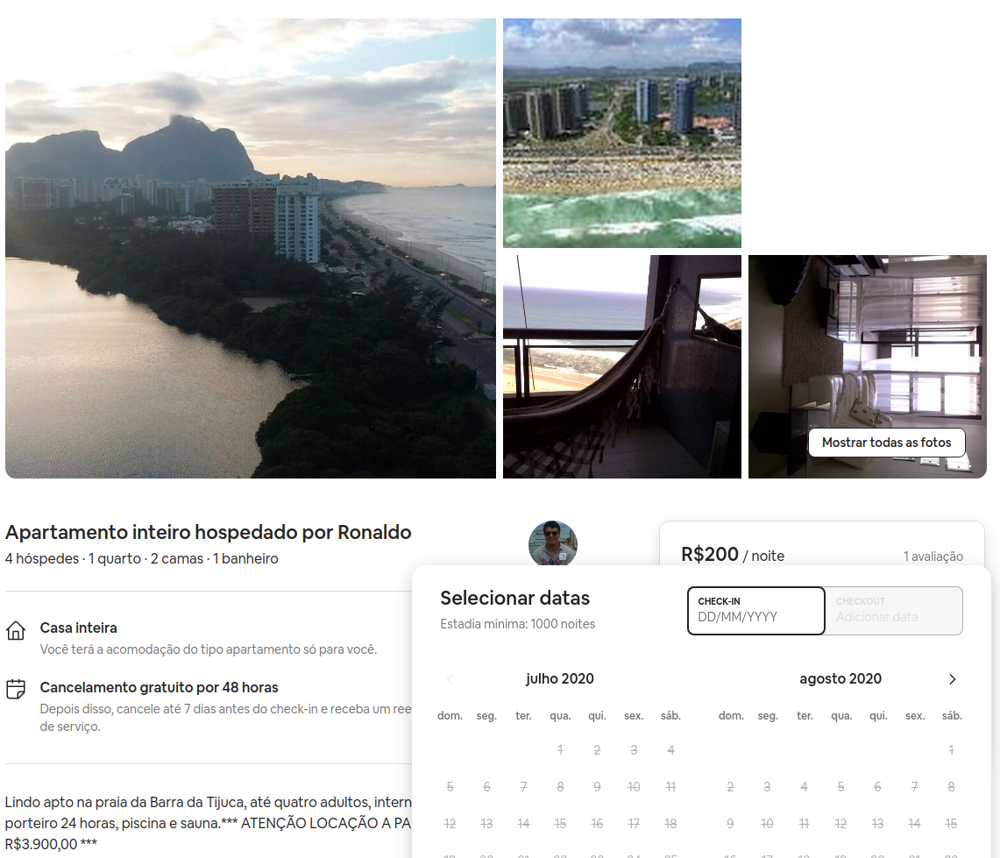

---
output:
  pdf_document:
    keep_tex: true
    pandoc_args: ["--top-level-division=chapter"]
---

```{r, message=F, echo=F}
library(magrittr)
kable <- function(data, caption = "", fonte = "O próprio autor"){
  knitr::kable(
    data, "latex", caption = caption, digits = 2,
    format.args = list(decimal.mark = ",", big.mark = ".")
  ) %>%
  kableExtra::footnote(
    general = fonte,
    general_title = "Fonte: ",
    footnote_as_chunk = T
  )
}
```

# APÊNDICE A {.unnumbered}

A Tabela \ref{tab:cluster_bairros} mostra o agrupamento de bairros utilizando o k-means.

```{r cluster_bairros, message=F, echo=F}
bairros = readRDS("../output/bairros_fim.rds")

bairros %>% dplyr::group_by(cluster) %>% dplyr::summarise(
    bairros = paste(unique(bairro), collapse = ", ")
  ) %>% kable(caption = "Clusters de bairros") %>% kableExtra::column_spec(2, width = "15cm")
```

A Tabela \ref{tab:desc_variaveis} descreve todas as variáveis utilizadas na modelagem.

```{r desc_variaveis, message=F, echo=F}
dplyr::tibble(
  `Nº` = 1:39,
  `Variável` = c("id","host_is_superhost","host_has_profile_pic","host_identity_verified",
    "neighbourhood_cleansed", "latitude", "longitude","property_type","room_type","accommodates","bathrooms","bedrooms","beds",
    "guests_included", "minimum_nights", "maximum_nights", "fl_periodo_longo","cancellation_policy", "zona", "subprefeitura",
    "esperanca_vida", "tx_alfabetizacao_adulta", "tx_frequencia_escolar", "renda_per_capita",
    "idh_longevidade", "idh_educacao", "idh_renda", "idh", "cluster",
    "cluster_4","price","fl_extra_people","price_near","bedrooms_near","beds_near","bathrooms_near",
    "fl_mais_banheiros","fl_mais_quartos","fl_mais_camas"),

  `Descrição` = c("Id gerado para identificar o imóvel","Anfitriões experientes","Anfitriões com foto no perfil",
    "Anfitriões com identidade verificada","Bairro da Propriedade","Latitude da propriedade","Longitude da propriedade",
    "Tipo de propriedade", "Tipo de quarto", "Número máximo de hóspedes","Banheiros na propriedade","Quartos na propriedade",
    "Camas na propriedade", "Total de hóspedes inclusos na diária","Quantidade Mínima de Noites",
    "Quantidade Máxima de Noites", "É Aluguel de Período Longo", "Política de cancelamento", "Zona da Propriedade",
    "Pequenos distritos", "Esperança de Vida do Bairro", "Taxa de Alfabetização Adulta", "Taxa de Frequência Escolar",
    "Renda per capita", "IDH de Longevidade", "IDH de Educação", "IDH de Renda", "IDH", "Cluster",
    "Bairro do cluster 4", "Preço para alugar a propriedade", "Cobrança por pessoa a mais", "Mediana do preço dos 15 vizinhos próx.",
    "Mediana do nº de quartos dos 15 vizinhos próx.","Mediana do nº de camasdos 15 vizinhos próx.",
    "Mediana do nº de banheiros dos 15 vizinhos próx.","Mais banheiros que os 15 vizihos próx.",
    "Mais quartos que os 15 vizihos próx.", "Mais camas que os 15 vizihos próx."),

  `Origem` = c("Airbnb", "Airbnb", "Airbnb", "Airbnb", "Airbnb", "Airbnb", "Airbnb", "Airbnb", "Airbnb", "Airbnb", "Airbnb",
               "Airbnb", "Airbnb", "Airbnb", "Airbnb", "Airbnb", "Criada", "Airbnb", "Data.RIO", "Data.RIO", "Data.RIO",
               "Data.RIO", "Data.RIO", "Data.RIO", "Data.RIO", "Data.RIO", "Data.RIO", "Data.RIO", "Criada", "Criada",
               "Airbnb", "Criada", "Criada", "Criada", "Criada", "Criada", "Criada", "Criada", "Criada")
) %>%
  kable(caption = "Variáveis na base")
```

{height=50%}

<!-- # APÊNDICE B {.unnumbered} -->

<!-- O código abaixo realiza a extração e as transformações iniciais das bases de dados. -->

<!-- ```{r code = readLines("../scripts/0_take_datasets.r"), echo = T, eval = F} -->
<!-- ``` -->

<!-- # APÊNDICE C {.unnumbered} -->

<!-- O código abaixo realiza as demais transformações das bases de dados. -->

<!-- ```{r code = readLines("../scripts/1_read_transform.r"), echo = T, eval = F} -->
<!-- ``` -->

# APÊNDICE B {.unnumbered}

O algoritmo abaixo realiza a otimização dos hiperparâmetros do Random Forest.

\begin{algorithm}[H]
  \KwData{Base de Treino}
  \KwResult{Hiperparâmetros com menor erro}

  \SetKwProg{Pn}{Fun\c{c}ão}{:}{\Return erro}
      \Pn{TestaHiperparametros(folds, [hiperparâmetros])}{

        erro = [] \;

         \Para{i = 1 \textbf{ at\'{e} } 10}{
            train = PegaPartesdeTreino(folds, i)

            test = PegaPartedeTeste(folds, i)

            model = RandomForest(train, [hiperparâmetros])

            erro.append(EQM(model, test))
        }
    }

  folds = Separar a base em 10 partes para validação cruzada

  \Para{i = 1 \textbf{ at\'{e} } T}{
    \nosemic amostra = Gera uma amostra aleatória com 10 hiperparâmetros não testados

    TestaHiperparametros(folds, amostra)

    modelo = RandomForest(Hiperpar\^ametros testados, erro \sim hiperpar\^ametros)

    previsão = Prevê o valor do erro dos hiperpar\^ametros não testados

    amostra = Avalia o top 10 com menor previsão de erro

    TestaHiperparametros(folds, amostra)
  }

\caption{Algoritmo para encontrar um bom conjunto de hiperparâmetros}
\label{alg:hiper}
\end{algorithm}

<!-- O código abaixo realiza a otimização dos hiperparâmetros do Random Forest. -->

<!-- ```{r code = readLines("../scripts/testa_hiper_rf.r"), echo = T, eval = F} -->
<!-- ``` -->
